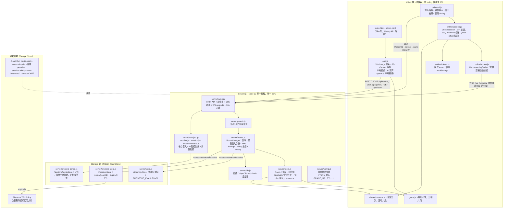
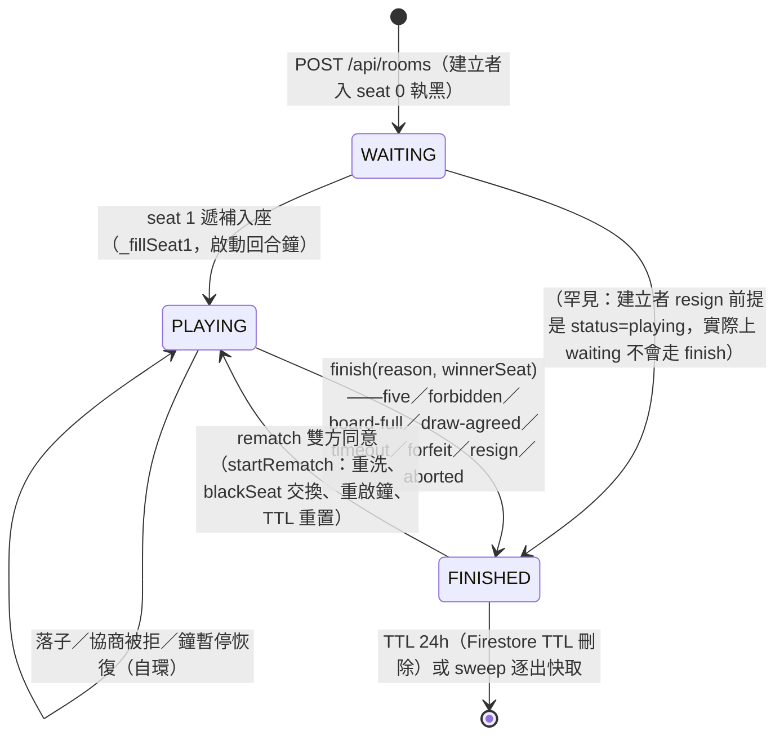
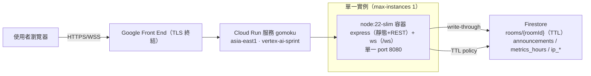

# 二、系統架構設計（System Architecture）

| 項目 | 內容 |
|---|---|
| 文件版本 | v1.0 |
| 撰寫日期 | 2026-08-29 |
| 產品名稱 | 五子棋 · Five Chess（Gomoku） |
| 對應程式版本 | v0.3.2（`package.json:4`） |
| 狀態 | 正式（Approved） |
| 資料來源 | 原始碼逐行考證（本文所有論述均標註 `檔案:行號`） |

> 本章描述系統的整體架構：分層結構、server-authoritative 設計原則、三端共用的規則引擎、WebSocket 協定、房間生命週期、deadline 計時模型、儲存抽象、部署拓撲、資產快取、安全防護與測試分層。文中所有論述皆以實際程式碼為準，並明確區分「**現況**」（程式碼已實作）與「**建議**」（未來演進方向）。

---

## 2.1 架構總覽

### 2.1.1 系統組成圖



> 圖為現況架構。三個「三端共用」的純 JS 模組（`game.js`、`shared/protocol.js`）以 UMD 同時供瀏覽器（掛 `window.Game` / `window.Protocol`）與 Node（`module.exports`）載入（`game.js:7-10`、`shared/protocol.js:7-11`），是 client 與 server 能共享同一份規則判定的技術基礎。

### 2.1.2 分層說明

| 分層 | 檔案 | 職責 | 依賴方向 |
|---|---|---|---|
| **Client · 畫面** | `index.html`、`admin.html`、`app.js`、`styles.css`、`online/ui.js` | 3D/2D 渲染、畫面路由（`/`、`/game`、`/online`、`/r/:roomId`）、聊天 drawer、協商 dialog、戰情中心 | → Client · 連線層、Shared |
| **Client · 連線層** | `online/socket.js`、`online/session.js`、`online/tokens.js` | WS 連線生命週期（重連/心跳/可見性）、協定訊息路由、座位 token 持久化 | → Shared |
| **Client · 本地規則** | `game.js`（瀏覽器側） | 單機模式的本地權威引擎（含 AI `chooseMove`，`game.js:775`）；線上模式僅作「渲染鏡像」 | → 無（純函式） |
| **Shared** | `shared/protocol.js` | WS 訊息型別、常數、欄位上限、文案（終局原因、規則集、24 句快速訊息）、`toStateDTO` | → 無（純函式） |
| **Server · 接口層** | `server/index.js` | HTTP REST、靜態檔、SPA 路由、WS upgrade 與心跳、上行訊息分派 | → Server · 領域層、Shared |
| **Server · 領域層** | `server/room.js`、`server/rooms.js` | Room 狀態機（坐席/回合鐘/協商/聊天/presence）、RoomManager（快取/併發合併/lobby/sweep） | → Shared、Storage |
| **Server · 橫切層** | `server/guards.js`、`ids.js`、`config.js`、`auth.js`、`ip-monitor.js`、`metrics.js`、`announcements.js` | 上行白名單窄化、id 生成、環境常數、後台驗證、IP 監控封鎖、負載指標、公告 | → Shared |
| **Storage** | `server/store.js`、`server/firestore-store.js`、`server/firestore-admin.js` | 可插拔 `RoomStore` 介面（InMemory ↔ Firestore）、後台資料持久化 | → GCP Firestore SDK（惰性載入） |

依賴嚴格單向：**畫面 → 連線層 → shared → server → storage**；規則引擎 `game.js` 不依賴任何一層（零 DOM、零 three.js、零 express），因此能被 `tests/game.test.js` 直接單元測試、被 `server/room.js` require、也被 `app.js` 載入。

---

## 2.2 Server-authoritative 原則

### 2.2.1 為何規則判定在伺服器（**現況**）

1. **公平性**：五子棋雖無隱藏資訊，但勝負判定、禁手、回合鐘、逾時判負若由 client 計算，作弊者可竄改；server 必須是最終裁決者。
2. **一致性**：`server/room.js` 是唯一「套用落子」的地方——`handleAction` 先 `evaluate()` 惰性結算逾時，再以規則引擎 `validateMove` 驗證、`place` 套用（`server/room.js:372-391`），任何 client 都無法繞過「還沒輪到你」「該位置已有棋子」「禁手」等檢查。
3. **重啟可救援**：權威狀態以 `RoomDoc` write-through 落地（`server/rooms.js:87-99`），行程重啟後由 `Room.fromDoc` 重建（`server/room.js:53-82`），規則引擎可從 `moves` 重放復原（`game.js:1043-1055`）。

### 2.2.2 `game.js`：純函式、零 DOM、三端共用的設計與好處（**現況**）

- **UMD 雙環境載入**：`game.js:1-10` 以 IIFE factory 同時支援 Node `module.exports` 與瀏覽器 `root.Game`；`shared/protocol.js:7-11` 同款。檔頭明訂「純遊戲邏輯：無 DOM、無 three.js，可於瀏覽器與 Node 獨立測試」（`game.js:1-5`）。
- **無 I/O、無時鐘**：所有函式皆為 `(board, x, y, who, …) → 結果` 的純輸入輸出；唯一的可變狀態封裝在 `createGame()` 回傳的 game 物件內（`game.js:824-990`），且可由 `snapshot()`（`game.js:979`）與 `fromMoves()`（`game.js:1043`）完整序列化/重建。
- **三端共用**：
  - **Server**：`server/room.js:4` require 後用於建立/重放/判定（`Room.create` → `Game.createGame`、`Room.fromDoc` → `Game.fromMoves`、`handleAction` → `validateMove`/`place`）。
  - **Client 單機**：`app.js` 以 `game.js` 為本地權威，AI 對弈直接呼叫 `game.aiMove()`。
  - **Client 線上**：同一份引擎做「渲染鏡像」——收到的 `state.moves` 餵進鏡像 game 物件繪製，**不做任何本地判定**。
- **好處**：
  1. 同一份規則碼不會出現「client 與 server 判定不一致」的整類 bug；
  2. 規則可在 Node 以 79 個單元測試覆蓋（`tests/game.test.js`），不必開瀏覽器；
  3. 未來若要出桌面版/App（Electron 等），引擎零改動即可移植。

### 2.2.3 Client 預測與伺服器權威的關係（**現況：不做樂觀預測**）

- 本專案採取「**server-ack 驅動渲染**」而非 client-side prediction：線上模式點擊棋盤**不直接落子**，只呼叫 `OnlineSession.sendAction(x, y)` 送出 `{t:"action", seq, action:{x,y}}`，**等 server 的 `actionApplied` 才套用渲染**（`app.js:1123-1129`：「線上模式：本地鏡像 game 只做渲染；權威狀態來自伺服器。點擊棋盤不直接落子…等 server actionApplied 才套用渲染」）。
- 動作者會收到帶自己 `seq` 的 `actionApplied` 副本（`server/room.js:406-411`），可與本地送出的 seq 對帳；對手與觀眾收到的副本則無 `seq`（`tests/integration.test.js:104-108` 驗證此行為）。
- 被拒時 server 回 `invalid`（含中文訊息、`seq`、`code:"forbidden-warn"`、`warn:{x,y,type}`）（`server/room.js:634-641`），client 據此提示，不會出現「本地已落子但被 server 打回」的回滾動畫。
- **取捨**：放棄預測換取零回滾複雜度；延遲敏感度低（回合制棋類，RTT 通常 < 100ms）。若未來要做「落子預覽動畫」，建議只做視覺性預覽（ghost stone），判定仍以 `actionApplied` 為準（**建議**，非現況）。

---

## 2.3 規則引擎細節（`game.js`，1058 行）

### 2.3.1 棋盤表示

| 項目 | 設計 | 來源 |
|---|---|---|
| 棋盤資料 | `board[x][y]` 二維陣列，值為 `0=EMPTY / 1=BLACK / 2=WHITE` | `game.js:17-19` |
| 尺寸 | 15×15（225 交點），`createGame` 允許自訂但至少 5×5 | `shared/protocol.js:43`、`game.js:827-829` |
| 方向常數 | `DIRS = [[0,1],[1,0],[1,1],[1,-1]]`（橫、直、＼、／） | `game.js:18` |
| 落子記錄 | `moves: [{x, y, player}]` 順序陣列，為持久化與重放的唯一事實來源 | `game.js:881` |
| 狀態快照 | `snapshot()` 回傳 `{board, winner, winLine, moves, turn, blackForbiddenWarned, forbidden, forbiddenType}` | `game.js:979-990` |
| 重建 | `Game.fromMoves(opts, moves)` 逐手重放；`blackForbiddenWarned` 需另行帶入（禁手首犯的手不會留在 moves 裡），重放失敗回 `null` | `game.js:1043-1055` |
| DTO | `Protocol.toStateDTO(game)` 把快照組成下行 `state` 欄位（含 `moveNumber` 等） | `shared/protocol.js:109-125` |

### 2.3.2 三種規則集與勝負判定

| 規則集 | 對應難度 | 黑棋勝負 | 白棋勝負 | 長連（>5）處置 | 黑棋禁手 | 來源 |
|---|---|---|---|---|---|---|
| `freestyle` 自由五子棋 | 簡單 | ≥5 連即勝 | ≥5 連即勝 | 算勝 | 無 | `game.js:99-104`、`shared/protocol.js:34-36` |
| `standard` 標準無禁 | 中等 | **剛好** 5 連 | **剛好** 5 連 | 不算勝，繼續下 | 無 | 同上 |
| `renju` 連珠 | 困難 | **剛好** 5 連 | ≥5 連即勝 | 黑棋=禁手判負；白棋算勝 | 三三／四四／長連 | 同上 |

- **兩個成五函式**：`winningLine`（≥min 即勝，`game.js:51-67`）與 `winningFiveLine`（剛好 =min 才算，`game.js:69-84`）。
- **規則分派**：`winLineForRules(board, x, y, who, min, ruleset)`（`game.js:99-104`）——freestyle 一律用 `winningLine`；renju 白棋用 `winningLine`、黑棋用 `winningFiveLine`；standard 雙方都用 `winningFiveLine`。
- **難度→規則對應**：`rulesetFor(difficulty)`（`game.js:86-91`）：easy→freestyle、hard→renju、其餘→standard；線上房間直接指定 `ruleset`，經 `Protocol.normalizeRuleset` 白名單化（未知值退回 `standard`，`shared/protocol.js:36`）。

### 2.3.3 黑棋禁手（僅 renju）

判定核心 `forbiddenReasonPlaced`（`game.js:351-361`），優先序為：

1. **先五為勝**：`isFive`（剛好五連，`game.js:311-318`）成立 → 非禁手（該手直接勝）。
2. **長連** `isOverline`（>5 連，`game.js:319-327`）→ 回 `"overline"`。
3. **四四** `isDoubleFour`（≥2 個「四」，`game.js:343-345`）→ 回 `"doubleFour"`。
4. **三三** `forbiddenDoubleThreePlaced`（`game.js:246-280`）→ 回 `"doubleThree"`。

實作要點（皆以程式碼為準）：

- **「四」的定義**：`fourStructuresInDirection`（`game.js:172-200`）以「補一子後該方向剛好成五」找四，含跳四；以四顆既有子的集合去重，避免活四的兩個成五點被重複計算。
- **活四／直四**：`straightFourCompletions`（`game.js:131-147`）要求兩個成五點補上後都是**精準五連**才算真 Straight Four（靠邊、被擋或會變長連的表面四不算）。
- **活三（RIF §3 的 Three）**：`threeStructuresInDirection`（`game.js:209-238`）檢查補四子後為連續四且該四有 ≥2 個精準成五點，且**不得同手成五**；`hasAllowedThreeExtension`（`game.js:282-296`）遞迴驗證每個延伸點不會自己變成禁手（雙三的合法發展性，§9.3）。
- **雙三遞迴判定**：`forbiddenDoubleThreePlaced` 內以 `renjuContext()`（`game.js:151-154`）做 memo（`forbiddenDoubleThree` 以盤面 hash `boardStateKey` + 座標為 key，`game.js:156-162`）與 `active` 防護，遞迴檢查延伸出的三三（`game.js:246-280`）。
- **白棋永不禁手**：`forbiddenReasonPlaced` 開頭 `if (who !== BLACK) return null`（`game.js:352`），且 freestyle/standard 直接回 null（`game.js:354`）。

**「首犯退回、再犯判負」寬容機制**（`game.place`，`game.js:894-916`）：

| 情境 | 行為 |
|---|---|
| 落子後成五 | 直接判勝（禁手不檢查，先五為勝） |
| 黑棋首次禁手 | 撤回該手（`board` 還原、`moves.pop()`）、`blackForbiddenWarned = true`、`forbiddenWarn = {x, y, type}` 供 UI 顯示，回 `false` |
| 落子後盤面和棋 | 見下節 |
| 當局再犯 | **保留該手**（顯示犯規位置）、`winner = 白`、`forbidden = true`、`forbiddenType = reason`，直接判負（`game.js:897-905`） |

`validateMove`（`game.js:925-939`）為**純驗證**（不變更狀態）：首犯回 `{ok:false, forbiddenWarn, message}`；再犯回 `{ok:true, forbiddenLoss: reason}`（合法且將直接判負）。Server 在 `handleAction` 先 `validateMove` 再 `place`（`server/room.js:379-391`），`invalid` 回覆帶 `code:"forbidden-warn"` 與 `warn` 欄位（`server/room.js:380`）。

### 2.3.4 和棋

- **盤滿和棋**：`game.place` 在無勝負且 `moves.length === size*size` 時 `winner = "draw"`、`turn = null`（`game.js:914-918`）；server 映射為終局原因 `"board-full"`（`server/room.js:421-425`）。
- **協議和棋**：與規則引擎無關，由房間層協商機制處理（見 §2.5.4），原因碼 `"draw-agreed"`。

### 2.3.5 悔棋 / 重開 / AI（單機模式）

| 函式 | 職責 | 來源 |
|---|---|---|
| `game.undo()` | 悔棋：vsAI 時撤「己方＋AI」兩手，雙人模式撤一手；清空 winner/winLine/forbidden 系列，`turn` 依殘餘 moves 重算 | `game.js:958-977` |
| `game.reset()` / `game.nextRound()` | 清盤重來 / 局數 +1 清盤 | `game.js:868-869` |
| `game.aiMove()` | 呼叫 `chooseMove` 後 `place`；若因黑棋禁手首犯被退回，清提示並重選避開禁手的一手 | `game.js:941-956` |
| `chooseMove` | AI 策略分派：easy=jitter 貪婪、medium=取殺/擋殺+貪婪、hard=取殺→必殺威脅（活四/雙四 `unstoppableMoves`）→ **VCF 連續衝四殺**（`vcf`，深度 10、節點 12000，`game.js:721-753`）→ 攔截對手必殺（`blockThreatMove`）→ 破壞對手 VCF（`defendVcf`）→ 威脅感知 alpha-beta `minimax`（深度 3、節點 2^20，`game.js:650-703`），全程排除黑棋禁手 | `game.js:775-822` |
| 樣式威脅評估 | `threatCountsPattern` 以整線正則樣式比對（`PATTERN_GROUPS`，`game.js:573-579`），能辨識跳三 `●●_●`、跳四 `●●_●●` 等斷點棋型；`threatScore` 疊加活叉加權 | `game.js:548-648` |

> AI 只存在於單機模式；線上房間 `createGame` 一律 `vsAI:false`（`server/room.js:40`），伺服器不做任何 AI 計算。

---

## 2.4 WS 協定（`shared/protocol.js`）

### 2.4.1 傳輸與編碼基礎

- 單一 port：HTTP、REST、靜態檔與 WS 共用；WS 走 `GET /ws` upgrade，手動處理（`noServer`，`server/index.js:350-373`）——路徑不符直接 `socket.destroy()`，封鎖中的 IP 回 `HTTP/1.1 403` 後銷毀。
- 訊息皆為 JSON 文字 frame；client 端 malformed frame 直接忽略（`online/socket.js:49-51`），server 端 JSON parse 失敗回 `{t:"error", code:"bad-message"}`（`server/index.js:442-451`）。
- **上行白名單**：`P.CLIENT_TYPES`（`shared/protocol.js:46-51`）定義 13 種上行型別；`guards.guardMessage`（`server/guards.js:20-104`）對未知 `t` 一律丟棄並回 `bad-message`，已知 `t` 逐欄位驗型與截斷。
- **欄位上限**：`P.LIMITS`（`shared/protocol.js:53-61`）——roomId 24、playerToken 64、joinName 24、chatRaw 500、chatText 120、cannedId 32、chatHistory 50、announcementAck 64。
- **錯誤碼**：`P.ERROR_CODES = ["room-not-found", "bad-message", "connected-elsewhere", "rate-limited"]`（`shared/protocol.js:93`）；WS close code 另有 `4000`（connected-elsewhere，`server/room.js:344`）與 `4003`（ip-blocked，`server/index.js:286, 437`）。

### 2.4.2 上行訊息（client → server，13 種，全數列於 `P.CLIENT_TYPES`）

| # | 型別 `t` | payload 欄位 | 方向 | 用途 | 處理入口 |
|---|---|---|---|---|---|
| 1 | `subscribeLobby` | 無 | C→S | 訂閱戰情中心名單推播 | `server/rooms.js:101-108` |
| 2 | `join` | `roomId`（必填）、`playerToken?`、`name?`、`spectate?` | C→S | 加入房間：token 認領座位 / 遞補白方 / 觀眾；重連時無縫續戰 | `server/index.js:508-526` → `room.join`（`server/room.js:339`） |
| 3 | `action` | `seq`（≥1 整數）、`action:{x,y}`（整數座標） | C→S | 落子；`seq` 為 client 遞增序號，僅回給動作者以對應自己的手 | `server/index.js:528-533` → `room.handleAction`（`server/room.js:372`） |
| 4 | `chat` | `text`（≤500 raw，server 再清洗至 120） | C→S | 聊天（觀眾可），滑動窗口限速 | `server/index.js:536-541` → `room.handleChat`（`server/room.js:558`） |
| 5 | `canned` | `id`（24 句快速訊息白名單 id） | C→S | 送出快速訊息（server 以 `Protocol.cannedText` 解析，未知 id 丟棄） | `server/index.js:544-549` → `room.handleCanned`（`server/room.js:578`） |
| 6 | `drawOffer` | 無 | C→S | 提議和棋 | `server/index.js:552` → `room.offerDraw`（`server/room.js:439`） |
| 7 | `drawResponse` | `accept`（boolean） | C→S | 回應和棋提議 | `server/index.js:553` → `room.respondDraw`（`server/room.js:447`） |
| 8 | `abortRequest` | 無 | C→S | 提議提前結束（不計勝負）；對手已斷線則直接結束 | `server/index.js:553` → `room.requestAbort`（`server/room.js:462`） |
| 9 | `abortResponse` | `accept` | C→S | 回應提前結束 | `server/index.js:554` → `room.respondAbort`（`server/room.js:474`） |
| 10 | `resign` | 無 | C→S | 認輸 | `server/index.js:556` → `room.resign`（`server/room.js:489`） |
| 11 | `rematch` | 無 | C→S | 提議再來一局（重洗、換先手） | `server/index.js:557` → `room.offerRematch`（`server/room.js:495`） |
| 12 | `rematchResponse` | `accept` | C→S | 回應再來一局 | `server/index.js:558` → `room.respondRematch`（`server/room.js:502`） |
| 13 | `announcementAck` | `id`（公告 uuid） | C→S | 全站公告已讀回條 | `server/index.js:490-506` → `announcements.ack` |

> guard 細節：`join.playerToken/name/spectate` 為可選欄位（有帶才驗），`action.seq` 必為 ≥1 整數、`action` 必為 `{x,y}` 整數物件；`announcementAck.id` 會剝控制字元後截斷至 64（`server/guards.js:33-90`）。

### 2.4.3 下行訊息（server → client，19 種）

| # | 型別 `t` | payload 欄位 | 方向 | 用途 | 發送點 |
|---|---|---|---|---|---|
| 1 | `joined` | `roomId, seat, roomStatus, blackSeat, state, deadline, chat, presence, gameOver, playerToken?` | S→C | join 的完整回應：座位、快照、聊天尾巴（50 則）、在席、鐘；`playerToken` 僅對坐席發（首次入座即拿到終身座位憑證） | `server/room.js:351-366` |
| 2 | `state` | `roomStatus, blackSeat, state, deadline` | S→C | 完整盤面快照廣播（對手遞補入座時讓等待方直接開打） | `server/room.js:188-196` |
| 3 | `actionApplied` | `by, action:{x,y}, state, deadline, seq?`（`seq` 僅動作者副本） | S→C | 落子已套用；client 以此為唯一渲染事實 | `server/room.js:401-417` |
| 4 | `invalid` | `message, seq?, code?, warn?` | S→C | 動作被拒（未輪到/對局結束/禁手首犯退回…） | `server/room.js:634-641` |
| 5 | `deadline` | `deadline`（見 §2.6.4 DTO） | S→C | 回合鐘三態變更（暫停/恢復/重啟） | `server/room.js:614-617` |
| 6 | `presence` | `presence:{seats:[{name,connected,graceDeadlineAt?}], spectators, spectatorList}` | S→C | 在席狀態（誰斷線、寬限倒數） | `server/room.js:319-337, 619-621` |
| 7 | `chat` | `msg:{id, from, kind, text, at, name?, cannedId?}` | S→C | 聊天訊息（`from` 為 0/1/`"spectator"`） | `server/room.js:558-596` |
| 8 | `drawOffered` | `by`（seat） | S→C | 和棋提議廣播 | `server/room.js:443` |
| 9 | `drawRejected` | `by` | S→C | 和棋被拒 | `server/room.js:457` |
| 10 | `abortOffered` | `by` | S→C | 提前結束提議廣播 | `server/room.js:470` |
| 11 | `abortRejected` | `by` | S→C | 提前結束被拒 | `server/room.js:484` |
| 12 | `rematchOffered` | `by` | S→C | 再來一局提議廣播 | `server/room.js:498` |
| 13 | `rematchRejected` | `by` | S→C | 再來一局被拒 | `server/room.js:509` |
| 14 | `rematchStart` | `blackSeat, state, deadline` | S→C | 新局開始（先手已交換） | `server/room.js:525-531` |
| 15 | `gameOver` | `reason, reasonText, winnerIndex, state, deadline:null` | S→C | 終局（八種 reason 見 §2.5.6） | `server/room.js:536-555` |
| 16 | `lobby` | `games`（房間摘要陣列，≤50） | S→C | 戰情中心名單（訂閱當下 + 50ms debounce 活動合併推播） | `server/rooms.js:101-133` |
| 17 | `announcement` | `id, text, at` | S→C | 全站公告（後台發佈，全房間 + 大廳訂閱者 fan-out；新 lobby 訂閱者先補收當前生效公告） | `server/index.js:192-215`、`server/rooms.js:103-107` |
| 18 | `error` | `code, message`（4 種 code） | S→C | 錯誤：`room-not-found`／`bad-message`／`connected-elsewhere`（附帶 close 4000 踢除舊連線）／`rate-limited`（聊天限速） | `server/index.js:444-451, 511-514`、`server/room.js:343-346, 561-563` |
| 19 | （WS close frame） | close code `4000`=connected-elsewhere、`4003`=ip-blocked | S→C | 連線層級的強制斷線 | `server/room.js:344`、`server/index.js:286, 437` |

### 2.4.4 協定版本與相容性策略（**現況**）

| 層 | 版本載體 | 策略 |
|---|---|---|
| 持久化文件 | `RoomDoc.version = 1`（`server/room.js:115`） | store 載入時 `data.version !== 1` 的文件直接跳過（`server/firestore-store.js:53`）；未來 schema 變更遞增 version 並在 `fromDoc` 做遷移。 |
| 上行相容 | `P.CLIENT_TYPES` 白名單（`shared/protocol.js:46`） | 未知型別一律丟棄回 `bad-message`（fail-closed）；新增欄位採「可選欄位、有帶才驗」方式，舊 client 不受影響。 |
| 下行相容 | client 訊息分發的 `default: break`（未知訊息忽略，`online/session.js:158-159`） | 新版 server 可安全推舊 client 沒有的訊息型別；舊 client 忽略即可（tolerant reader）。 |
| 版號 | `package.json version` → `config.VERSION`（`server/config.js:38`）→ `/api/health` 公開（`server/index.js:114`）與首頁 `.entry-version` 顯示 | 每次部署遞增（見《開發規格》版號規則），部署後以 `/api/health` 驗證。 |
| 協定文案 | 終局原因文案集中在 `P.GAME_OVER_REASONS`（`shared/protocol.js:21-30`） | server 傳 `reason` 機器碼＋`reasonText` 人類文案，client 可只顯示 `reasonText`，未來多語可由 client 端自行以 `reason` 對應。 |

---

## 2.5 房間生命週期（`server/room.js` + `server/rooms.js`）

### 2.5.1 房間狀態機



狀態值定義於 `Protocol.ROOM_STATUS`（`shared/protocol.js:18`）：`waiting` / `playing` / `finished`。轉移點集中在三處：`_fillSeat1`（`server/room.js:183-197`）、`finish`（`server/room.js:536-555`）、`startRematch`（`server/room.js:515-532`）。

### 2.5.2 建立（HTTP）

`POST /api/rooms`（`server/index.js:297-306`）：名稱截斷至 `LIMITS.joinName`、`ruleset` 經 `normalizeRuleset` 白名單化 → `RoomManager.createRoom` → `Room.create`（`server/room.js:32-50`）：

- `roomId = ids.newRoomId()`（10 碼不可猜，見 §2.7.4）；
- 建立者即 `seat 0`（黑方先手，`room.blackSeat = 0`，`server/room.js:37`）並取得 `playerToken`；
- `expireAt = now + STALE_TTL_MS`（7 天）；
- 立即 `persist()` 寫入 store 並 `notifyActivity()` 觸發 lobby 推播（`server/rooms.js:51-58`）。

### 2.5.3 加入與座位分配（`assignSeat`，`server/room.js:153-181`）

三步驟判定：

1. **token 認領**：帶 `playerToken` 且符合 seat 0/1 → 直接認領（即使帶 `spectate` 也不推去觀眾）；若該座位已有別的 socket，舊 socket 收 `error connected-elsewhere` 後被 `close(4000)` 踢除（單座位單連線，`server/room.js:341-349`）。
2. **遞補白方**：seat 1 空著、非 finished 且未指定 `spectate` → 生成新 token 入座，並觸發 `_fillSeat1`：`waiting → playing`、啟動回合鐘、廣播 `state` 讓等待方直接開打（`server/room.js:183-197`）。
3. **其餘 → 觀眾**：`spectators: Map<socketId, {name}>`，可聊天、可觀戰，不可參與協商與落子（協商函式開頭 `if (seat !== 0 && seat !== 1) return`，`server/room.js:449, 475, 503`）。

`join` 回應（`joined`）一次帶齊：快照、鐘、聊天尾巴、presence、終局結果；坐席另附 `playerToken`（`server/room.js:351-366`）。換房時 client 端 socket 先被舊房 `disconnect`（`server/index.js:508-514`）。

### 2.5.4 落子流程（`handleAction`，`server/room.js:372-419`）

```
evaluate()（先惰性結算逾時）
  → 驗 seat / status=playing / 輪到誰（未輪到回 invalid）
  → game.validateMove(x, y, playerColor)（純驗證：座標、空格、禁手首犯/再犯）
  → game.place(...)（套用；禁手再犯在此直接判負）
  → 清空 draw/abort 協商狀態
  → game.isOver() ? finish(_reasonFromGame, _winnerSeatFromGame) : _startTurnClock()
  → 廣播 actionApplied（動作者副本含 seq；觀眾也收）
  → persist（由 index.js 於 handler 後統一執行）
```

`_reasonFromGame` 把引擎結果映射為終局原因：`winner==="draw"→"board-full"`、`snap.forbidden→"forbidden"`、其餘 `"five"`（`server/room.js:421-427`）。

### 2.5.5 斷線與重連（token 認領）

- **斷線 ≠ 離開**：`ws close` 時僅清 `seatSockets[seat]`、`connected=false`、移除觀眾與聊天限速記錄（`server/room.js:199-212`）；座位本體（`seats[s]` 與 token）保留，這是「同一連結重開即續戰」的基礎。
- **輪到誰走誰斷線 → 鐘暫停 + 寬限窗**（`_pauseClockIfTheirTurn`，`server/room.js:214-226`）：`deadlineAt` 存入 `pausedRemainingMs`、開 `graceDeadlineAt = now + GRACE_MS`。
- **重連**：client `OnlineSession` 每次連上自動重送 `join`（`online/session.js:65-72`），server 憑 token 認領座位並 `_resumeClock` 恢復剩餘時間（`server/room.js:349-350, 258-268`）；回應的 `joined` 帶完整快照，重連即無縫復原（`tests/integration.test.js:117-143` 驗證）。
- **WS 自動重連**：`ReconnectingSocket` 指數退避 1s ×1.7 → 上限 10s；`visibilitychange` 回前景立即重試；`close()` 後不再重連（`online/socket.js:1-8, 58-66, 68-80`）。

### 2.5.6 終局（`finish`，`server/room.js:536-555`）

八種終局原因（`shared/protocol.js:21-30`）：

| reason | 中文文案 | 觸發點 |
|---|---|---|
| `five` | 五子連線，分出勝負 | 落子後成五（`server/room.js:421-427`） |
| `forbidden` | 黑棋觸犯禁手，判定敗北 | 禁手再犯（`game.js:899-909`） |
| `board-full` | 棋盤下滿，判定和棋 | 225 手無勝負（`game.js:914-918`） |
| `draw-agreed` | 雙方同意和棋 | 和棋協商（`server/room.js:447-454`） |
| `timeout` | 走棋逾時，判定敗北 | `evaluate` 行動鐘逾期（`server/room.js:281-284`） |
| `forfeit` | 斷線逾時未回，判定敗北 | `evaluate` 寬限逾期（`server/room.js:275-279`） |
| `resign` | 認輸 | `resign`（`server/room.js:489-493`） |
| `aborted` | 對戰提前結束，不計勝負 | 提前結束協商（對手斷線可直接結束，`server/room.js:462-487`） |

`finish` 收鐘（turn 三值清空）、清協商、`expireAt = now + FINISHED_TTL_MS`（24h）、清 nudge timer、廣播 `gameOver` 並推 presence/activity。

### 2.5.7 逾時與清理（TTL / sweep）

| 機制 | 參數 | 行為 | 來源 |
|---|---|---|---|
| 房間快取 sweep | `ROOM_SWEEP_MS=60s` | 週期掃快取：`expireAt` 過期 → dispose + 從快取移除 + `store.delete`；`finished` 且無任何連線（`isIdleFinished`）→ dispose 逐出快取（store 裡留到 TTL） | `server/rooms.js:232-254`、`server/room.js:656-664` |
| Firestore TTL | finished 24h / 未結束 7 天 | 文件帶 `expireAt`，由 Firestore TTL policy 自動刪除（`gcloud firestore fields ttls update expireAt`） | `server/firestore-store.js:1-6`、`server/config.js:29-30`、`deploy.sh:55-58` |
| lobby 曝光 | waiting 建立滿 30 秒才公開；finished 終局後保留 5 分鐘 | `isLobbyListable` 純函式判定（waiting 房僅存在於快取，重啟後不從 store 撈） | `server/rooms.js:12-28, 186-208` |
| WS 心跳 | 30s ping，沒 pong terminate | 防止 Cloud Run/代理砍靜默連線造成的殭屍 socket | `server/index.js:566-576`、`server/config.js:18` |

### 2.5.8 RoomManager 的併發與一致性（`server/rooms.js`）

- **並發載入合併**：`get(roomId)` 以 `inFlight: Map<roomId, Promise>` 合併同房間併發載入，避免重啟後兩人同時 join 造出兩個分岔 Room（`server/rooms.js:61-84`）；房號先過 `ids.ROOM_ID_RE` 格式檢查，不合法直接回 null（`server/rooms.js:62`）。
- **write-through + 每房寫入序列化**：`persist` 把 `store.save` 接在該房的 `writeChains` Promise 鏈後，慢寫不會被後寫超車；寫入失敗僅記 log、鏈不中斷（`server/rooms.js:87-99`）。
- **lobby 推播**：房間活動經 `notifyActivity` 以 50ms debounce 合併後 push 給所有訂閱者（`server/rooms.js:115-133`）；名單由「快取房 + store.listActive」合併去重、updatedAt 新→舊排序（`server/rooms.js:186-208`）。

---

## 2.6 計時模型：deadline 時間戳惰性判定

### 2.6.1 為何 setTimeout 不可靠（架構鐵則）

- Cloud Run 的 request-based billing 會在無請求時 **throttle CPU**：`setTimeout` 的回調可能被無限期延後甚至暫停；若勝負判定「依賴計時器準點觸發」，部署在 Cloud Run 上就會出現「鐘早該判負卻遲遲不判」的錯誤。
- 因此本專案的鐵則是（`AGENTS.md`「架構鐵則」、`server/config.js:1-3`）：**計時一律以 deadline 時間戳惰性判定，計時器只做 nudge 且必須 `.unref()`**。

### 2.6.2 回合鐘三態（`room.turn`）

`room.turn = { deadlineAt, pausedRemainingMs, graceDeadlineAt }`（`server/room.js:41`），三態：

| 狀態 | deadlineAt | pausedRemainingMs | graceDeadlineAt | 語意 |
|---|---|---|---|---|
| **正常** | `now + TURN_MS`（60s） | null | null | 輪到的坐席在線，鐘正常跑 |
| **暫停（寬限）** | null | 剩餘思考時間 | `now + GRACE_MS`（90s） | 輪到的坐席斷線：鐘凍結，開寬限窗等重連 |
| **終局** | null | null | null | 對局結束 |

- 開鐘 `_startTurnClock`（`server/room.js:239-255`）：依輪到者是否在線決定落入「正常」或「暫停」。
- 恢復 `_resumeClock`（`server/room.js:258-268`）：寬限內 token 認領回座位 → `deadlineAt = now + pausedRemainingMs`，思考時間不縮水。
- 輔助 nudge `_scheduleNudge`（`server/room.js:288-303`）：對最近的一個期限 +20ms 排一個 `setTimeout(...).unref()` 觸發 `evaluate`——**它只是「儘快結算」的加速器，不是真相來源**；漏觸發也不影響正確性，因為下一次任何事件（join/action/協商/stats）都會再 `evaluate()`。

### 2.6.3 `evaluate()`：惰性判定（`server/room.js:272-286`）

```js
evaluate() {
  if (this.status !== PLAYING || this.game.isOver()) return;
  if (t.graceDeadlineAt && now >= t.graceDeadlineAt) → finish("forfeit", 對手)
  if (t.deadlineAt      && now >= t.deadlineAt)      → finish("timeout", 對手)
  this._scheduleNudge();  // 沒逾期：排下一次 nudge
}
```

呼叫點涵蓋所有事件路徑：`join`、`handleAction`、所有協商入口、`disconnect`、`RoomManager.stats()`（後台 gauge 也順手結算，`server/rooms.js:213-221`）。**判定只讀 `Date.now()` 與時間戳，永不依賴「計時器有沒有響」**，因此行程重啟、事件迴圈卡頓、CPU throttle 都不會造成誤判。

### 2.6.4 deadline DTO 與時鐘偏移校正（clock offset）

`deadlineDTO()`（`server/room.js:305-317`）隨每則相關下行訊息附帶：

```js
{ seat, at: deadlineAt|null, pausedRemainingMs, graceAt: graceDeadlineAt|null, serverNow: now() }
```

client 端（`online/session.js:173-204`）：

- 收到任何含 `deadline` 的訊息時 `_applyDeadline` 以 `clockOffset = serverNow - Date.now()` 校正本機時鐘偏移（`online/session.js:32, 175-178`）；
- 250ms tick 的倒數以 `Date.now() + clockOffset` 換算為**伺服器時鐘**再算剩餘（`online/session.js:191-202`），避免 client 時鐘不準導致倒數失真；
- `serverNow()` 對外提供校正後的伺服器現在時間（`online/session.js:203-204`）。
- 逾時的**判定權**仍在 server（§2.6.3）；client 的倒數只是 UI 顯示，偏多少都不會改變勝負。

### 2.6.5 重啟救援（`_restartRescue`，`server/room.js:94-110`）

部署重啟（或 crash）後由 store 載入的 `playing` 房間：

- 停機期間**過期的期限絕不溯及判負**（`server/room.js:50` 註解）：原本在寬限 → 寬限重算 `now + GRACE_MS`；
- 行動鐘 → 轉為「暫停 + 全新寬限窗」，且 `pausedRemainingMs` 至少保留 10 秒可思考；
- 這保證「重啟不懲罰玩家」，代價是重啟當下所有對局的鐘會多給一輪寬限（設計上可接受的取捨）。行為由 `server/tests/timers.test.js` 覆蓋（13 個計時測試）。

---

## 2.7 儲存抽象

### 2.7.1 Store 介面（`server/store.js:10-37`）

`RoomStore` 為隱式介面（duck typing），五個方法：

| 方法 | 語意 |
|---|---|
| `load(roomId)` | 取單一 `RoomDoc`（不存在回 null） |
| `save(doc)` | 整份覆寫（write-through） |
| `delete(roomId)` | 刪除 |
| `listActive(limit)` | lobby 名單：`playing`（+ 保留期內 `finished`），updatedAt 新→舊 |
| `listAll()` | 全量（測試/維運用） |

`RoomDoc`（一房一份、重啟可完整重建，`server/store.js:1-8`、`server/room.js:112-137`）：

```js
{ version: 1, roomId, status, ruleset, size, blackSeat,
  seats: [{token, name}|null, {token, name}|null],
  stateJson: { size, ruleset, moves, blackForbiddenWarned },   // 由 moves 重放即完整盤面
  turn: { deadlineAt, pausedRemainingMs, graceDeadlineAt },
  negotiation: { draw, abort, rematch },
  chatJson: [...最近 50 則],
  result: { reason, winnerIndex } | null,
  createdAt, updatedAt, expireAt }
```

### 2.7.2 兩個實作與 `FIRESTORE_ENABLED` 開關（**現況**）

| | `InMemoryStore`（`server/store.js:10`） | `FirestoreStore`（`server/firestore-store.js:9`） |
|---|---|---|
| 適用 | 本機開發（`npm run dev`）、測試 | 正式 Cloud Run（`FIRESTORE_ENABLED=1`） |
| 持久性 | 行程內 Map（deep-copy 存取，`save` 經 `JSON.parse(JSON.stringify)`） | `rooms/{roomId}` 一房一文件 |
| JSON 欄位 | 原生物件 | `stateJson/negotiationJson/chatJson` 存 JSON **字串**（Firestore 不收 undefined），`expireAt` 存 Timestamp（`server/firestore-store.js:52-78`） |
| 清理 | 由 `RoomManager.sweep` 移除 | Firestore TTL policy 依 `expireAt` 自動刪 + sweep 主動 `delete` |
| `listActive` | 記憶體過濾 | `where("status","in",["playing","finished"]).limit(200)` 單欄位查詢（免複合索引），記憶體內過濾 `version===1` 與 `isLobbyListable` 後排序（`server/firestore-store.js:44-57`） |

- 開關：`FIRESTORE_ENABLED: process.env.FIRESTORE_ENABLED !== "0"`（`server/config.js:33`）——**預設開啟**，`FIRESTORE_ENABLED=0` 才切回 InMemory。
- 裝配（`server/index.js:581-605`）：進入點依開關動態 `require` FirestoreStore / FirestoreAdminStore；初始化失敗自動退回 InMemoryStore 並記錄錯誤（降級不中斷服務）。`createServer` 本身不建立網路連線，store 可注入（測試用 InMemoryStore，`tests/integration.test.js:15`）。
- **後台資料**另走 `FirestoreAdminStore`（`server/firestore-admin.js`）：collections `announcements`（公告+已讀名單）、`metrics_hours`（指標小時彙總，doc id = ISO 時間前 13 碼冪等覆寫）、`ip_hours` / `ip_blocks` / `ip_alerts`（IP 流量/封鎖/告警），過期資料以 300 筆為一批刪除（`server/firestore-admin.js:105-115`）。細節留待〈05 後端與管理後台〉章。

### 2.7.3 房號 / token / id 生成策略（`server/ids.js`，**現況**）

| 項目 | 生成方式 | 熵與格式 | 用途 |
|---|---|---|---|
| `roomId` | `crypto.randomBytes(10)` 每 byte `% 28` 取 `ALPHABET` | 28^10 ≈ 2.96×10^14 組合；10 碼小寫，正則 `^[a-z2-9]{10}$` | 邀請連結 `/r/{roomId}` 是唯一入場憑證 |
| `playerToken` | `crypto.randomBytes(16).toString("hex")` | 128-bit；32 碼 hex | 座位所有權憑證（localStorage + join 重送） |
| `newChatId` | `crypto.randomBytes(8).toString("hex")` | 64-bit | 聊天訊息 id |

`ALPHABET = "abcdefghjkmnpqrstuvwxyz23456789"`——22 個字母（**去 i/l/o**）+ 6 個數字（2-6、9），共 28 個無歧義字元：口播、手抄、QR 掃描都不會混淆（`server/ids.js:5-8`）。房號不可猜 ⇒ 「知道房號」即視為被邀請；座位權限則由 token 把關，兩層憑證分離。

---

## 2.8 部署拓撲與可擴展性

### 2.8.1 現況拓撲（**現況**）



- 一鍵部署 `bash deploy.sh`（`deploy.sh:42-54`）：Cloud Build → `gcloud run deploy`，關鍵參數：`--session-affinity`、`--timeout 3600`、`--min-instances 0`、`--max-instances 1`、`--memory 512Mi`、`--cpu 1`、`--allow-unauthenticated`；部署後自動設定 Firestore TTL（`deploy.sh:55-58`）。
- 映像：`node:22-slim`，`npm install --omit=dev`，單容器同時服務靜態檔、REST 與 WS（`Dockerfile`）。

### 2.8.2 為何 session-affinity 必要（**現況**）

- WS 是**長連線**；房間的權威狀態（坐席、鐘、協商、聊天、觀眾）存在**該實例的記憶體**（`RoomManager.cache`，`server/rooms.js:38`）。若同一房間的兩個玩家被路由到不同實例，他們會看到兩個分岔的房間，對局直接失真。
- session-affinity 讓同一 client（後續請求與 WS）盡量落到同一實例；再配合 `--max-instances 1`，房間狀態在單實體內全域一致（`deploy.sh:45, 48`、`AGENTS.md`）。
- Firestore 在此架構中的角色是「**重啟可重建**」而非「多實體共享狀態」：write-through 持久化 + `Room.fromDoc` 重放，讓部署/崩潰後房間可還原（並由 §2.6.5 的重啟救援保護玩家）。

### 2.8.3 水平擴展限制（**現況**）

| 限制 | 說明 | 來源 |
|---|---|---|
| 單實體記憶體 | 快取房間、lobby 訂閱者、指標分鐘桶（72h）都在行程內；多實體會各自持有分岔狀態 | `server/rooms.js:38-43`、`server/metrics.js:47` |
| lobby 名單跨實體不完整 | `listGames` 合併「本實體快取房 + store.listActive」，但觀眾數等即時欄位僅快取房準確 | `server/rooms.js:186-208` |
| 全站公告 fan-out | `manager.announce` 只打到本實體快取房與大廳訂閱者 | `server/rooms.js:226-228` |
| session-affinity 是 best-effort | 實例縮放/重啟時連線仍會掉，client 以自動重連 + token 重送兜底（§2.5.5） | `online/socket.js` |

### 2.8.4 未來演進（**建議**，現況未實作）

| 方向 | 做法 | 解決什麼 |
|---|---|---|
| 多實體讀取層 | lobby 名單全面改讀 Firestore（或加 Redis 快取），觀眾數改為 store 端欄位 | 拆掉「lobby 需要全域視野」對單實體的依賴 |
| 房間黏著 + 跨實體路由 | 以 `roomId` 做一致性雜湊的 proxy/路由層（或 WS gateway + 每房單一 owner 實體） | 房間狀態仍單點持有，但連線可分散 |
| 跨實體事件 | Pub/Sub 廣播協定訊息（每房一 topic 或單一 fan-out topic）；`finish`/`actionApplied` 經 Pub/Sub 同步 | 公告、lobby 推播、房間事件跨實體可見 |
| 狀態外移 | Firestore listener（snapshot listener）驅動房間狀態同步，或以 Firestore 交易做落子 CAS | 真正無狀態的 WS tier；代價是延遲與成本上升，回合制棋類可接受 |
| 擴容閘 | `--max-instances` 提高前，先把「房間 → 實例」的路由做出來，否則擴了實體只是分裂狀態 | 避免盲目加實體 |

> 優先序建議：若用戶量成長，先做「lobby 讀 store」與「roomId 路由」即可支撐數倍負載；Pub/Sub 廣播是第二階段；完整 listener 化是長期重構，須重新評估 §2.6 的計時模型是否仍以 owner 實體為準。

---

## 2.9 資產快取策略（**現況**）

### 2.9.1 `?v=__ASSET_VER__` 內容雜湊注入

- `index.html` / `admin.html` 的靜態資產引用統一掛佔位符，如 `<script src="/app.js?v=__ASSET_VER__"></script>`（`index.html:390-397`、`index.html:74`）。
- 伺服器**於請求時**注入：`getVersionedHtml` 以正則把 `(src|href)="...?v=__ASSET_VER__` 換成 `?v=<sha1 前 8 碼>`；`assetVersion(relPath)` 讀檔內容算 sha1 取前 8 碼，讀不到檔案則退回套件版號（`server/index.js:75-95`）。
- **效果**：檔案內容改變 → URL 改變 → 瀏覽器必抓新版；內容不變 → URL 不變 → 永久命中快取。零 build 前提下做到「發佈即生效、無快取幽靈」。
- Cache-Control 分級（`server/index.js:339-347`）：

| 資產 | Cache-Control |
|---|---|
| HTML（SPA 殼） | `no-cache`（每次都驗，確保拿到最新 `?v=` 引用） |
| 帶 `?v=` 的 JS/CSS/圖片 | `public, max-age=31536000, immutable`（一年，內容尋址） |
| 其他靜態檔 | `public, max-age=3600`（一小時） |

- 新增前端檔案也必須掛 `?v=__ASSET_VER__`（`AGENTS.md` 架構鐵則），否則只能享一小時快取且發佈後可能拿到舊版。

### 2.9.2 three.js vendor 與 CDN 的取捨（**現況**）

- three.js 是唯一第三方遊戲資源，由 CDN 載入：`<script src="https://unpkg.com/three@0.160.0/build/three.min.js"></script>`（`index.html:76-78`）；載入失敗（離線/被牆）自動降級 2D Canvas 渲染，遊戲不受影響（`README.md`「離線可玩」）。
- qrcode 與 Chart.js 則以本機 vendor 檔提供：`assets/vendor/qrcode.min.js`（邀請連結 QR，隱私考量不外送請求）與 `assets/vendor/chart.umd.min.js`（後台負載圖），同樣掛 `?v=__ASSET_VER__`（`index.html:391`、`AGENTS.md`）。
- 取捨：CDN 換來零倉庫體積與快取紅利，但引入外部可用性依賴——因此 2D 備援是必要保險；QR Code 涉及「把房間連結送給第三方統計」的隱私顧慮，故本機化。未來若要完全離線化，可將 three.js 也收進 `assets/vendor/`（**建議**，非現況）。

---

## 2.10 安全與防護架構總覽（高層次；細節見〈05 後端與管理後台〉）

| 防護面 | 機制與落點 |
|---|---|
| **上行輸入驗證（第一道閘）** | WS 訊息一律先過 `guards.guardMessage` 白名單窄化：未知 `t` 丟棄回 `bad-message`；已知 `t` 逐欄位驗型、截斷至 `P.LIMITS`（`server/index.js:442-451`、`server/guards.js:20-104`）。JSON body 限 16kb（`server/index.js:125`）。 |
| **規則驗證（第二道閘）** | 即使通過 guard，落子仍須通過規則引擎 `validateMove` + `place` 的伺服器端判定（回合、座標、禁手），client 無法以偽造訊息取得規則外權限（`server/room.js:372-391`）。 |
| **文字清洗** | 暱稱/聊天剝控制字元（`\u0000-\u001f\u007f`）→ trim → 碼點截斷（`sanitizeName`/`sanitizeChatText`，`server/room.js:16-27`）；公告同款清洗（`server/index.js:192-206`）。 |
| **聊天限速** | per-socket 滑動窗口：10 秒 5 則 + 最小間隔 600ms，超量回 `error rate-limited`（`server/room.js:559-611`、`server/config.js:21-23`）。 |
| **座位憑證** | `playerToken` 128-bit 亂數（`server/ids.js:20-22`）；單座位單連線——舊連線被 `close(4000)` 踢除（`server/room.js:341-349`）；token 只經 `joined` 發給坐席本人。 |
| **房間隱私** | 房號 10 碼 28 字元集不可猜（§2.7.3）；等待房建立滿 30 秒才上戰情中心，快速私密開局不上板（`server/rooms.js:12-28`）。 |
| **IP 監控與封鎖** | 全域中介層記錄 HTTP/WS 流量、閥值告警；封鎖中的 IP：HTTP 403（後台與健康檢查豁免，`IP_BLOCK_EXEMPT_RE`）、WS 升級直接拒絕、既有連線 close 4003（`server/index.js:32, 98-107, 354-373, 286, 437`）。 |
| **後台驗證** | Google Identity Services ID token 驗簽 → `ADMIN_EMAILS` allowlist → HttpOnly HMAC session cookie（`ADMIN_SESSION_SECRET`；`server/index.js:36-40, 150-190`）。 |
| **傳輸** | 全站 HTTPS/WSS（Cloud Run 強制 TLS）；`trust proxy` + `X-Forwarded-For` 第一跳取真實 client IP（`server/index.js:48-58`）。 |

---

## 2.11 測試架構

### 2.11.1 執行方式（**現況**）

- `npm test` = `node --test tests/*.test.js server/tests/*.test.js`（`package.json:6`）——Node 內建測試框架（`node:test`/`node:assert`），**零第三方測試套件**。
- `npm run coverage` = 同上 + `--experimental-test-coverage`（`package.json:7`）。
- 全部 226 個測試：根目錄 122（前端/規則/整合）+ server 104（單元）。

### 2.11.2 分層

| 層 | 檔案 | 測試數 | 涵蓋 |
|---|---|---|---|
| **規則引擎單元** | `tests/game.test.js` | 79 | 勝負判定（三規則集）、禁手（三三/四四/長連、先五為勝、首犯退回）、和棋、悔棋、`fromMoves` 重放、AI |
| **前端 smoke（headless DOM）** | `tests/app.smoke.test.js` | 17 | 2D 渲染路徑、UI 狀態、畫面互動 |
| **3D 渲染** | `tests/app3d.test.js` | 6 | three.js 渲染路徑與降級 |
| **client 通訊層** | `tests/online.test.js` | 7 | `OnlineSession`/`ReconnectingSocket`：join 重送、seq、clock offset、重連退避 |
| **lobby 規則** | `tests/lobby-rules.test.js` | 6 | `isLobbyListable` 純函式：30 秒曝光/5 分鐘保留/未知狀態 |
| **整合（真實 HTTP+WS）** | `tests/integration.test.js` | 7 | 起 `createServer`（InMemoryStore）走真實埠：建立→加入→對弈→五連→再來一局換先手、token 重連拿完整快照、lobby 曝光規則、SPA 路由、錯誤碼（`tests/integration.test.js:41-143, 335-352`） |
| **server 單元** | `server/tests/*.test.js` | 114 | `room`（23：坐席/協商/終局）、`timers`（13：deadline 惰性判定/鐘暫停/寬限恢復/重啟救援）、`chat`（9：清洗/限速/canned）、`guards`（7：白名單窄化）、`store`（7）、`auth`（12）、`admin-routes`（9）、`ip-monitor`（11）、`metrics`（6）、`announcements`（7） |

分層意涵：規則引擎測試不碰網路（純函式可測性的直接紅利，§2.2.2）；server 行為測試以 `server-test-utils.js` 注入假 transport 直測 Room/RoomManager；整合測試驗證「HTTP+WS+store」真實組裝下的端到端契約——三層各自對應 §2.1 的一個架構切片，任何一層的回歸都能被最小範圍的測試捕捉。

---

## 2.12 本章小結

| 設計決策 | 一句話理由 |
|---|---|
| 規則引擎 `game.js` 純函式、零 DOM、UMD 三端共用 | client/server 共享同一份判定，消除兩端規則分歧；Node 直接單元測試 |
| Server-authoritative + 不做樂觀預測 | 權威在 server，client 等 `actionApplied` 才渲染；回合制遊戲延遲可接受，換取零回滾複雜度 |
| WS 協定集中於 `shared/protocol.js`、上行白名單窄化 | 未知訊息 fail-closed；欄位上限集中在單一檔，client/server 同源 |
| 房間狀態機 waiting/playing/finished + token 認領座位 | 斷線≠離開；邀請連結＋token 即完整重連憑證 |
| deadline 時間戳惰性判定（`evaluate`），setTimeout 僅 `.unref()` nudge | Cloud Run CPU throttling 下計時器不可靠；真相以時間戳 + 事件驅動結算，重啟不溯及判負 |
| 可插拔 RoomStore（InMemory ↔ Firestore TTL） | 本機零依賴、正式免維運清理；`createServer` 不建網路連線，測試可注入 |
| session-affinity + max-instances 1 | 房間權威狀態在單實體記憶體；擴展路徑（讀 store、roomId 路由、Pub/Sub）已標記為建議 |
| `?v=` 內容雜湊請求時注入 + HTML no-cache | 零 build 前提下兼得發佈即生效與資產永久快取 |

> 下一章〈03 技術採用〉將展開前述架構的具體技術選型（Node 22、express 5、ws 8、Firestore 9、three.js 0.160 等）與版本管理策略。