# 四、前台（前端畫面與互動）規劃（Frontend Screens & Interaction Spec）

| 項目 | 內容 |
|---|---|
| 文件版本 | v1.0 |
| 撰寫日期 | 2026-08-29 |
| 產品名稱 | 五子棋 · Five Chess（Gomoku） |
| 對應程式版本 | v0.3.2（`package.json` version） |
| 狀態 | 正式（Approved） |
| 涵蓋範圍 | 入口畫面、單機 3D／2D 棋盤、線上大廳與戰情中心、建立/加入/等待房間、對局 HUD、聊天與人員名單、協商與確認對話框、History API 路由、重連 UX、設計系統、資源載入、無障礙、效能 |

> 本章為「前台（前端畫面與互動）」的規格書章節。所有 UI 元件均標註 DOM id 與來源檔案:行號；行號以 v0.3.2 原始碼為準。流程以 Mermaid 圖呈現。行為規格的測試證據見 §4.14。

---

## 目錄

- [4.1 前端架構總覽與全域 API](#41-前端架構總覽與全域-api)
- [4.2 畫面清單與層級（DOM id 對照表）](#42-畫面清單與層級dom-id-對照表)
- [4.3 入口流程與伺服器探測](#43-入口流程與伺服器探測)
- [4.4 History API 路由（深連結與瀏覽器上一頁）](#44-history-api-路由深連結與瀏覽器上一頁)
- [4.5 單機模式規格（3D 棋盤／2D 備援）](#45-單機模式規格3d-棋盤2d-備援)
- [4.6 規則集選擇 UI 與暱稱驗證](#46-規則集選擇-ui-與暱稱驗證)
- [4.7 線上大廳與戰情中心](#47-線上大廳與戰情中心)
- [4.8 房間畫面規格（等待／加入／對局／終局）](#48-房間畫面規格等待加入對局終局)
- [4.9 錯誤處理與重連 UX](#49-錯誤處理與重連-ux)
- [4.10 設計系統（色彩／字體／按鈕／動畫／RWD／無障礙）](#410-設計系統)
- [4.11 資源載入與快取](#411-資源載入與快取)
- [4.12 前端狀態管理與事件綁定清單](#412-前端狀態管理與事件綁定清單)
- [4.13 瀏覽器相容與效能考量](#413-瀏覽器相容與效能考量)
- [4.14 行為規格測試對照表](#414-行為規格測試對照表)

---

## 4.1 前端架構總覽與全域 API

### 4.1.1 鐵則

- **前端零 build**：所有 JS/CSS 皆為原生檔案直接載入，不使用 bundler（AGENTS.md「架構鐇則」；`index.html:390-397`）。唯一第三方資源為 three.js（CDN）與 qrcode.min.js（本機 vendor）。
- **Server-authoritative**：線上對戰時本地鏡像棋局只做渲染，規則裁決一律由伺服器回傳；`game.js` 為純函式規則引擎、零 DOM 依賴，client 與 server 共用（`game.js:1-8`、`app.js:1128-1131` 註解）。
- **2D 備援保證可玩**：three.js 載入失敗（離線／被擋）時自動降級為 2D Canvas 渲染（`app.js:531-543` `buildView()`、`index.html:79-80` 註解）。

### 4.1.2 腳本載入順序（`index.html:390-397`）

| # | 檔案 | 角色 |
|---|---|---|
| 1 | `game.js` | 純規則引擎（UMD → `window.Game`） |
| 2 | `assets/vendor/qrcode.min.js` | QR Code 產生（本機打包，無網路依賴 → `window.QRCode`） |
| 3 | `shared/protocol.js` | WS 協定型別／文案（→ `window.Protocol`） |
| 4 | `online/socket.js` | ReconnectingSocket（指數退避 → `window.ReconnectingSocket`） |
| 5 | `online/tokens.js` | 座位 token／暱稱 localStorage（→ `window.OnlineTokens`） |
| 6 | `online/session.js` | OnlineSession（→ `window.OnlineSession`） |
| 7 | `app.js` | 單機遊戲與 3D／2D 渲染（→ `window.GomokuApp`／`GomokuOnline`／`GomokuEntry`） |
| 8 | `online/ui.js` | 線上流程黏合（→ `window.GomokuConfirm`；boot 時探測 `/api/health`） |

> three.js 於 `<head>` 由 CDN 載入：`<script src="https://unpkg.com/three@0.160.0/build/three.min.js">`（`index.html:78`），不掛 `?v=`（外部資源不参与內容雜湊）。

### 4.1.3 全域物件契約（跨模組黏合介面）

| 全域物件 | 定義位置 | 用途 |
|---|---|---|
| `window.Game` | `game.js:1053` | 規則引擎：`createGame()`、`fromMoves()`、禁手判定、AI `chooseMove()` 等 |
| `window.Protocol` | `shared/protocol.js:9` | 訊息型別、`LIMITS`、`CANNED_MESSAGES`（24 句快速訊息）、`reasonText()`、`toStateDTO()` |
| `window.ReconnectingSocket` | `online/socket.js:24` | WS 自動重連（斷線指數退避 1s→×1.7→10s） |
| `window.OnlineTokens` | `online/tokens.js:37` | `saveToken/loadToken/clearToken/saveName/loadName` |
| `window.OnlineSession` | `online/session.js:198` | 一房一 session：join 重送、seq 遞增、deadline 倒數（時鐘偏移校正） |
| `window.GomokuApp` | `app.js:1287-1309` | 單機除錯／測試 API：`game`、`stats`、`place()`、`newGame()`、`undo()`、`share()`、`download()`、`captureShare()`、`getShareFilename()`、`setPlayerSide()` |
| `window.GomokuOnline` | `app.js:1207-1286` | 線上模式整合 API：`enter()`、`leave()`、`applyState(dto)`、`showResult(info)`、`hideResult()`、`markFinished()`、`onPick(handler)`、`refresh()`、`isActive()`、`ctx` |
| `window.GomokuEntry` | `app.js:1076` | 入口畫面開關：`show()`／`hide()`（供 online/ui.js 的「回主畫面」使用） |
| `window.GomokuConfirm` | `online/ui.js:1565` | 共用確認框：`open(title, sub, okText, onOk, cancelText, onCancel)`／`close()`（app.js 的「回主畫面」確認也用這組） |
| `window.__onlineSession` | `online/ui.js:793` | 除錯／支援用把手（當前 OnlineSession） |

### 4.1.4 架構分層圖

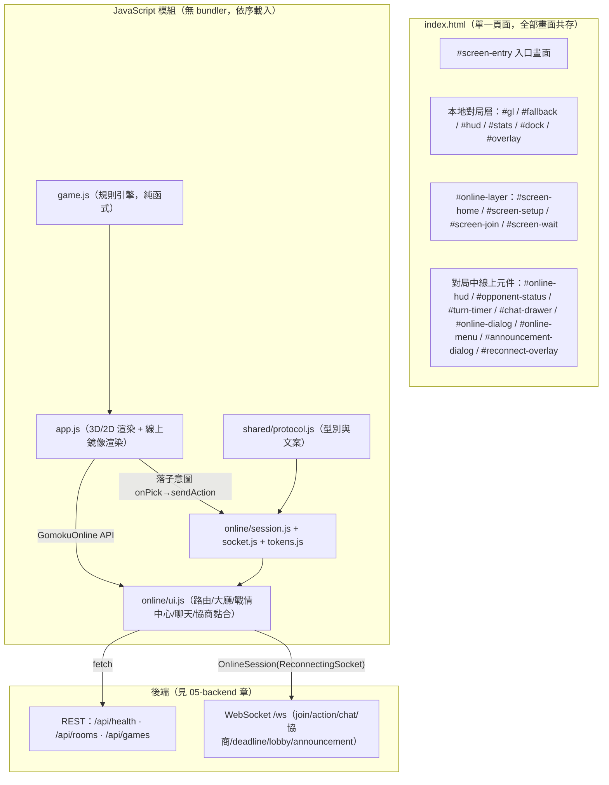

---

## 4.2 畫面清單與層級（DOM id 對照表）

### 4.2.1 畫面（section 級）

| DOM id | 名稱 | 用途 | 顯示條件 | 來源 |
|---|---|---|---|---|
| `#screen-entry` | 入口首頁 | 選擇「開始遊戲（單機）」或「線上對戰」 | 預設顯示（HTML 可見）；`body.entry-open` 為開啟狀態。`/game`、`/r/:roomId` 深連結、線上流程接管時加 `.hidden` 收起 | `index.html:185-209`、`app.js:1063-1074`、`online/ui.js:129-133` |
| （無 id，基礎層） | 本地遊戲畫面 | 3D/2D 棋盤 + HUD + Dock + Overlay，位於 `#screen-entry` 下方 | 入口收起後可見（`/game` 深連結或「開始遊戲」） | `index.html:81-183` |
| `#online-layer` | 線上對戰層 | 包住線上四個畫面與大廳 footer 的全螢幕層（z-index 40） | 探測到 `/api/health` 且進入線上流程；`showScreen()` 顯示、`showGameView()`／`hideOnlineLayer()` 隱藏 | `index.html:211`、`online/ui.js:112-143` |
| `#screen-home` | 線上大廳 | 「建立房間對戰」CTA + 戰情中心（war-center）+ Footer 版號 | `showScreen("home")`：按「線上對戰」、`/online` 深連結、popstate 對齊、離開房間 | `index.html:214-250`、`online/ui.js:112` |
| `#screen-setup` | 建立房間 | 規則集 seg（自由/標準/連珠）+ 暱稱輸入 + 建立/返回 | `openSetupScreen()`：按大廳「⚔️ 建立房間對戰」 | `index.html:253-273`、`online/ui.js:336` |
| `#screen-join` | 加入／觀戰 | 輸入暱稱後加入房間（座位滿則自動成為觀眾） | 無 token 開啟 `/r/:roomId`（`openJoinScreen()`）；標題/提示依 `?spectate=1` 切換 | `index.html:275-289`、`online/ui.js:378-387` |
| `#screen-wait` | 等待對手 | 邀請連結 + 複製鈕 + QR Code + 取消 | 建立者 join 成功且 `roomStatus==="waiting"`（`showWaitScreen()`） | `index.html:291-303`、`online/ui.js:903-912` |

> 前台僅上述 7 個 section 級畫面；其餘皆為浮層（dialog／drawer／overlay，見 §4.2.2–4.2.3）。

### 4.2.2 對局中元件（本地與線上共用棋盤層）

| DOM id | 用途 | 來源 |
|---|---|---|
| `#stage` / `#gl` / `#fallback` / `#grade` | 3D canvas、2D 備援 canvas、螢幕漸層覆蓋 | `index.html:81-85`、`styles.css:44-62` |
| `header.top` `.brand` | 品牌字樣（GOMOKU／五子棋 · 見賢思齊） | `index.html:88-92` |
| `#hud` > `#turn`（`.turn`）> `#turn-dot`、`#turn-label`、`#turn-timer` | 回合膠囊：輪到誰＋棋子 dot；點擊可重新開啟結果看板；`#turn-timer` 內嵌倒數 | `index.html:94-101`、`app.js:907-968` `refresh()`、`app.js:1136-1161` `refreshOnline()`、`online/ui.js:1233-1252` `renderTurnTimer()` |
| `#stats` > `#s-round`、`#s-stones`、`#s-black`、`#s-white`、`#s-winrate`、`#s-streak`、`#s-status`、`#s-mode` | 戰績面板（局數/子數/黑白/勝率/連勝/狀態/對戰模式） | `index.html:102-111`、`app.js:907-968` |
| `#dock`（`#dock-close`、`#zoom-range`、`#zoom-value`、`#btn-new`、`#btn-undo`、`#btn-mode`、`#mode-label`、`.seg [data-diff]`、`#seg-side [data-side]`） | 本地控制列：難度、執子陣營、縮放、新局、撤銷、模式切換；右上角 X 可收起（行動/桌面皆可），收起後由 `#dock-open` 重開 | `index.html:113-148`、`app.js:984-1043` `wireUI()` |
| `#dock-open` | 收合後重開控制列的浮動鈕（右上角） | `index.html:145-147`、`styles.css:106-121` |
| `#btn-game-home` | 「🏠 主畫面」浮動鈕（本地對局中顯示；`body.entry-open`／`body.mode-online` 時隱藏） | `index.html:149`、`styles.css:335-349`、`app.js:1111-1130` |
| `#hint` | 操作提示（6.5 秒後淡出；2D 模式改為降級說明文字） | `index.html:151`、`app.js:540`、`app.js:1050` |
| `#toast`（role=status, aria-live=polite） | 禁手／警告／複製結果等 toast（3.6 秒自動消失） | `index.html:153`、`app.js:894-899`、`online/ui.js:91-99` |
| `#overlay`（結果看板 card：`#ov-close`、`#ov-emoji`、`#ov-title`、`#ov-sub`、`#ov-rematch`、`#ov-new`、`#ov-share`、`#ov-download`） | 對局結束／進行中資訊對話框；本地與線上終局共用 | `index.html:155-183`、`app.js:622-627`、`app.js:871-887`、`app.js:1246-1273` `showResult()` |

### 4.2.3 線上對局元件與浮層

| DOM id | 用途 | 顯示條件 | 來源 |
|---|---|---|---|
| `#opponent-status` | 「對手已斷線」膠囊（fixed，回合膠囊下方） | 對手 seat `connected=false` 時顯示，重連後隱藏 | `index.html:308`、`online/ui.js:1254-1281` |
| `#online-hud` > `#btn-chat`（`#chat-badge`）、`#btn-online-menu` | 對局中右上角浮動 HUD：聊天按鈕（含未讀徽章）與「⋯」選單 | 進入對局畫面（`showGameView()`） | `index.html:309-312`、`online/ui.js:135-142` |
| `#reconnect-overlay`（role=alert） | 「連線中斷，重新連線中…」全螢幕遮罩（pulse 動畫） | 對局中 WS down；up 後隱藏 | `index.html:314-316`、`online/ui.js:983-997`、`styles.css:512-522` |
| `#chat-drawer` > `#drawer-head`、`#tab-chat`/`#tab-people`、`#pane-chat`（`#chat-list`、`#chat-chips`、`#chat-form`、`#chat-input`）、`#pane-people`（`#people-players`、`#people-spectators`、`#people-spec-count`） | 聊天抽屜：聊天室／人員雙分頁，可拖曳 | `#btn-chat` 開合；Esc 關閉 | `index.html:319-348`、`online/ui.js:188-239`（拖曳）、`online/ui.js:1039-1135` |
| `#online-dialog`（`#od-title`、`#od-sub`、`#od-ok`、`#od-cancel`） | 通用確認 dialog：協商徵詢、認輸/離開/結束對戰確認、「回主畫面」確認 | `openConfirm()` | `index.html:350-360`、`online/ui.js:241-251` |
| `#online-menu`（`#menu-copy`、`#menu-draw`、`#menu-abort`、`#menu-resign`、`#menu-leave`、`#menu-close`） | 線上對戰選單（⋯ 開啟） | `openMenu()`；和棋/結束/認輸僅坐席且對局進行中可用 | `index.html:362-377`、`online/ui.js:1333-1430` |
| `#announcement-dialog`（`#announcement-text`、`#announcement-time`、`#btn-announcement-ack`） | 全站公告強制閱讀 dialog（唯一關閉路徑＝「我知道了」，送已讀回條；z-index 90 全站最高） | 收到 `{t:"announcement"}` 且未讀 | `index.html:379-387`、`online/ui.js:478-534` |

### 4.2.4 z-index 疊層表（`styles.css`）

| z-index | 元件 | 來源 |
|---|---|---|
| 2 | `#grade` 螢幕漸層 | `styles.css:49` |
| 5 | `header.top`、`#hud`、`#stats`、`#dock` | `styles.css:65,84,172,86` |
| 6 | `#hint`、`#dock-open` | `styles.css:276,106` |
| 7 | `.game-home-open`（主畫面鈕） | `styles.css:338` |
| 8 | `#online-hud`、`#opponent-status` | `styles.css:524,531` |
| 9 | `#toast` | `styles.css:281` |
| 10 | `#overlay` 結果看板 | `styles.css:203` |
| 40 | `#online-layer` | `styles.css:353` |
| 45 | `#screen-entry` 入口首頁 | `styles.css:629` |
| 60 | `#reconnect-overlay` | `styles.css:513` |
| 70 | `#chat-drawer` | `styles.css:546` |
| 80 | `#online-dialog`、`#online-menu` | `styles.css:616` |
| 90 | `#announcement-dialog`（公告最高，不可被其他浮層蓋住） | `styles.css:617` |

---

## 4.3 入口流程與伺服器探測

### 4.3.1 入口畫面元件（`#screen-entry`）

| 元件 | 說明 | 來源 |
|---|---|---|
| `.entry-eyebrow`／`.entry-title`／`.entry-sub` | 品牌區：「3D 線上五子棋」眉標、漸層大標 GOMOKU、副標 | `index.html:188-190`、`styles.css:646-663` |
| `#btn-entry-local`（`.entry-btn.primary`） | 「開始遊戲」：對戰 AI／雙人同屏 · 3D 棋盤。**預設顯示** | `index.html:193-196` |
| `#btn-entry-online`（`.entry-btn.online`） | 「線上對戰」：邀請好友 · 即時觀戰 · 聊天室。**初始 `hidden`**，探測成功才顯示 | `index.html:197-200`、`online/ui.js:270` |
| `#entry-offline-note`（`hidden`） | 「線上對戰需對戰伺服器 — 目前以單機模式執行」：探測失敗（純靜態託管）才顯示 | `index.html:201`、`online/ui.js:275-278` |
| `.entry-footer` > `.entry-copyright`、`.entry-version` | 版權與版號。**入口版號為手動寫死**（隨 `package.json` 同步更新，見 AGENTS.md 版號規則） | `index.html:202-208`、`styles.css:707-716` |

### 4.3.2 探測與啟動流程

`online/ui.js` `boot()`（`online/ui.js:1567-1574`）→ `buildChips()` → `wire()` → `loadAckedAnnouncements()` → `probeHealth()`。`app.js` 的 `boot()`（`app.js:1045-1056`）亦會呼叫 `initEntryScreen()` 接入口按鈕。

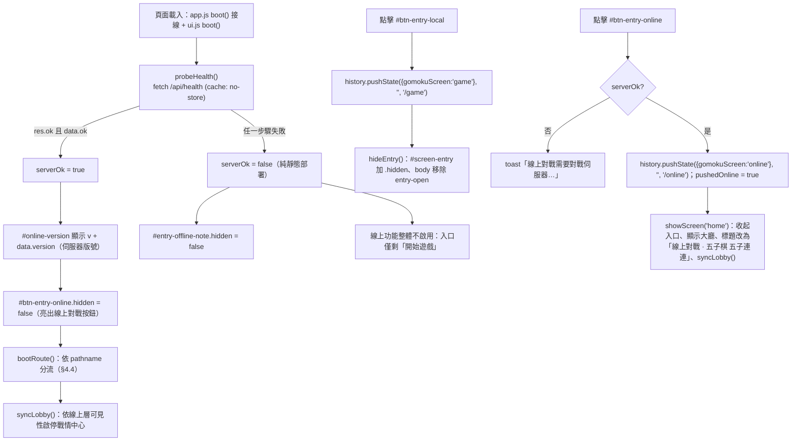

- 探測實作：`online/ui.js:259-283` `probeHealth()`。
- 「開始遊戲」：`app.js:1098-1104`（pushState `/game` + 收起入口；靜態託管不支援 pushState 時 try/catch 忽略，畫面照切）。
- 「線上對戰」：`online/ui.js:1442-1448`。
- 線上大廳頁面標題 `LOBBY_TITLE = "線上對戰 · 五子棋 五子連連"`（`online/ui.js:85`）；對局中還原 `originalTitle`（`online/ui.js:138-140` `showGameView()`）。
- 版號顯示雙源：入口 `.entry-version` 手動寫死（`index.html:205`）；大廳 `#online-version` 由 `/api/health` 的 `data.version` 動態注入（`online/ui.js:266-268`）——兩處必須一致（部署驗證 `curl /api/health`）。

---

## 4.4 History API 路由（深連結與瀏覽器上一頁）

### 4.4.1 路由規格

| URL | 畫面 | 觸發 | 來源 |
|---|---|---|---|
| `/` | 入口首頁 | 預設；popstate 對齊 | `online/ui.js:322-323` |
| `/game` | 本地遊戲畫面（入口收起） | 「開始遊戲」push；深連結/重整直接對齊（開頁不 pushState） | `app.js:1095-1104` `initEntryScreen()`、`online/ui.js:308-315` |
| `/online` | 線上大廳 | 「線上對戰」push（state `{gomokuScreen:"online"}`）；深連結/重整直接對齊 | `online/ui.js:1442-1448`、`online/ui.js:289-291` |
| `/r/:roomId` | 房間深連結（邀請連結） | 建立房間後 `replaceState`；邀請連結直入 | `online/ui.js:283-287` `parseRoomFromPath()` |
| `/r/:roomId?spectate=1` | 觀戰深連結 | 戰情中心「進入觀戰」`replaceState` | `online/ui.js:735-741` `goSpectate()` |

- **房號解析**：`location.pathname.match(/^\/r\/([a-z2-9]{10})$/i)`，取 10 碼（小寫化）——Crockford 風格房號（`online/ui.js:283-287`）。
- **開頁分流** `bootRoute()`（`online/ui.js:283-297`）：`/r/` → `openRoomUrl()`；`/online` → `showScreen("home")`（不再 pushState）；`?spectate=1` 但路徑缺房號（罕見）→ 回 `home`。
- **邀請直入**：`openRoomUrl()`（`online/ui.js:324-331`）——`OnlineTokens.loadToken(roomId)` 有 token 就**靜默重連回座**（帶 token join）；否則進 `#screen-join` 暱稱頁。
- **`/r/` 開頁跳過入口**：`app.js:1093-1096` 亦於 `initEntryScreen()` 判定 `/^\/r\//` 即 `hideEntry()`。

### 4.4.2 pushState 與「回主畫面」的雙策略

設計原則：**曾由本頁 push 過路徑者，回上一頁走 `history.back()`（畫面切換統一交給 popstate）；直接載入該路徑（背後無本站歷史）者，就地 `replaceState` 並切畫面**。

| 按鈕 | 有 push 過（`history.state.gomokuScreen` 有值） | 無 state（深連結直入） | 來源 |
|---|---|---|---|
| 入口「開始遊戲」 | push `/game` + state `game` | — | `app.js:1098-1104` |
| 對局中「🏠 主畫面」（`#btn-game-home`） | `exitGameToHome()`：state 為 `game` → `history.back()`；否則 `replaceState("/")` + `showEntry()` | 同左；未落子直接回、已落子先經 `GomokuConfirm` 確認（進度保留） | `app.js:1080-1088`、`app.js:1111-1130` |
| 入口「線上對戰」 | push `/online` + state `online`，`pushedOnline=true` | — | `online/ui.js:1442-1448` |
| 大廳「← 回主畫面」（`#btn-back-home`） | `history.back()` | `replaceState("/")` + `goEntryHome()` | `online/ui.js:1436-1441` |
| 大廳 URL 同步 | `syncOnlineUrl()`：`replaceState(pushedOnline ? {gomokuScreen:"online"} : null, "", "/online")` | 離開房間/返回大廳時保持 URL 正確 | `online/ui.js:146-149` |

### 4.4.3 popstate 對齊矩陣（`online/ui.js:300-322` `onPopState()`）

核心需求：**瀏覽器上一頁在「入口 ↔ 遊戲 ↔ 大廳 ↔ 房間」之間任意移動，畫面都對齊 URL**；popstate 內**不得再 push/replace**。

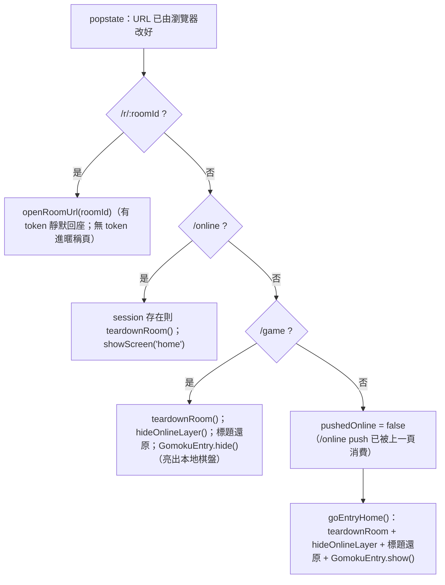

### 4.4.4 完整導航流程圖

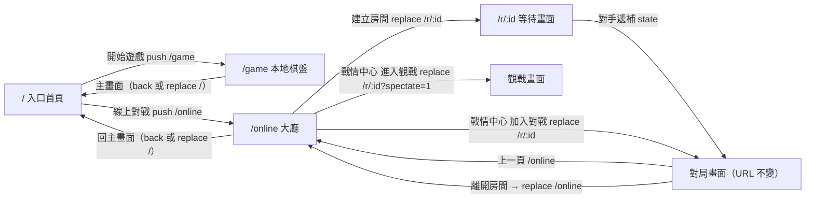

---

## 4.5 單機模式規格（3D 棋盤／2D 備援）

### 4.5.1 視圖建構與 2D 備援觸發條件

`buildView()`（`app.js:531-543`）：**以 `typeof window.THREE === "undefined"` 為唯一判準**。

- 有 THREE → 顯示 `#gl`、隱藏 `#fallback`，建立 `make3DView()`；否則反向建立 `make2DView()`。
- 降級時 `#hint` 改為「已切換 2D 模式（無法載入 3D 引擎）· 點擊棋盤落子」（`app.js:540`）。
- 兩種視圖實作相同介面（`place/markLast/markWin/clearMarks/showMoveNumbers/hideMoveNumbers/setZoom/reset/onPick/onHover/resize`），控制器（`placeAt` 等）不感知差異（`app.js:356-409`、`app.js:414-529`）。

### 4.5.2 3D 場景規格（`make3DView()`，`app.js:127-379`）

| 項目 | 規格 | 來源 |
|---|---|---|
| Renderer | `WebGLRenderer({antialias:true, alpha:true})`；`setPixelRatio(min(devicePixelRatio,2))`；PCFSoftShadowMap | `app.js:130-134` |
| Camera | Perspective fov=46、near 0.1、far 100；orbit 參數 `radius 15, theta 0.6, phi 0.92` | `app.js:136,297` |
| 燈光 | Ambient 0.55 + 冷色補光 Directional(0xbfd4ff,0.35) + 主光 Directional(白,1.15) 投影 2048²、範圍 ±12 | `app.js:140-151` |
| 棋盤 | BoxGeometry 厚 1 深色檯面 + PlaneGeometry 木紋貼圖（1024² CanvasTexture：漸層木色、棋線、5 星位；anisotropy 4） | `app.js:155-168`、`app.js:381-411` |
| 棋子 | Cylinder(r 0.42→0.392, h 0.28, 48 seg)；黑/白 MeshStandard 材質；castShadow | `app.js:310-312,196-200` |
| 落子編號 | 每子一張 128² CanvasTexture 數字（黑子白字黑描邊、白子深字），100 手以上縮小字級；`labels` 群組預設隱藏，**關閉結果浮層後才顯示**（`closeOverlay` → `showMoveNumbers`） | `app.js:225-259`、`app.js:616-620` |
| 最後一手 | 紅色 Torus 標記（emissive 0xff2d1f） | `app.js:177-184` |
| 懸停指示 | 淺藍 Ring（opacity 0.22），pointermove 拾取平面投影到格點 | `app.js:187-193,301-315` |
| 勝局高亮 | 金色 Torus 環（預設 0xffcf5a；禁手判負改紅 0xff5a4d），每幀以 `emissiveIntensity = 0.65 + sin(4t)*0.35` 脈動 | `app.js:258-268,335-341`、`app.js:871-887` |
| 落子動畫 | 自 y=6 以 0.32 秒三次方 ease 落下（棋子與編號 label 同步）；`instant=true` 直接就位（重放/重建用） | `app.js:198-231,329-341` |

**互動（僅 3D）**（`app.js:301-348`）：

- **拖曳旋轉**：pointerdown 記錄起點；pointermove（按住）以 `dθ = -dx*0.006`、`dφ = -dy*0.006` 轉動 orbit，`phi` 夾在 0.32–1.35；位移 >5px 視為拖曳（`moved`），放開時不觸發落子。
- **滾輪縮放**：`preventDefault`（non-passive）；radius 增量 `deltaY*0.012`，夾在 zoom 30–130 對應的半徑區間；反算百分比回呼 `onZoom` → 同步 `#zoom-range`／`#zoom-value`／`aria-valuetext`（`app.js:970-982`；測試證據 `tests/app3d.test.js:171-185`）。
- **拾取落子**：pointerup 且未拖曳且未鎖定 → raycaster 交 y=0 平面 → `Math.round` 至格點 → `onPick`（`app.js:317-327`）。
- radius 全域夾在 8–60（`app.js:299`）。

### 4.5.3 2D 備援檢視規格（`make2DView()`，`app.js:414-529`）

- 高 DPI：`dpr = min(devicePixelRatio,2)`，canvas 實體尺寸 = 視窗 × dpr。
- 版面：`cell = min((w-90)/14, (h-90)/14) × zoom/100`；置中繪製。圓角檯面、漸層木紋、棋線、星位、黑白棋子（radial gradient 立體感）、勝局圓圈高亮、最後一手紅圈。
- 互動：僅 pointerdown 拾取落子（無旋轉）；`setZoom` 支援縮放重繪；`onHover` 為空實作。
- 繪製為「按需重繪」（事件驅動 `draw()`），無 requestAnimationFrame 迴圈——低階裝置省電省 CPU。

### 4.5.4 遊戲流程與控制（控制器，`app.js:549-1043`）

| 行為 | 規格 | 來源 |
|---|---|---|
| 落子 | `placeAt()`：AI 思考中（`locked`）或輪到 AI 時忽略；呼叫 `game.place()`；禁手首犯以 `game.forbiddenWarn` 顯示警告 toast 並退回 | `app.js:549-572` |
| AI 回應 | `requestAI()`：鎖定輸入、`setBusy(true)`，**230ms 延遲後** `game.aiMove()`，落子動畫後解鎖 | `app.js:574-585` |
| 難度 | 簡單/中等/困難 → 規則集自由/標準/連珠（`game.js rulesetFor`）；切換即改 `game.difficulty` 並保存設定 | `app.js:984-994`、`game.js:90-94` |
| 執子陣營 | 執黑（預設）/執白；執白時 AI 為黑先手；切換即開新局；`#seg-side` 在雙人模式加 `.disabled`（不可切換） | `app.js:995-1004,1013-1031` |
| 模式切換 | `#btn-mode` 對戰 AI ↔ 雙人類（`#mode-label` 文案同步）；雙人模式無 AI | `app.js:1025-1035` |
| 新局 | `#btn-new`／`#ov-new`：重建 game、清盤、關面板與浮層、hide toast；輪到 AI 則自動先手 | `app.js:601-614` |
| 撤銷 | 對戰 AI 一次撤「己方+AI」兩手（`game.undo()` take=2）；次數限制：**簡單無限、中等 1 次、困難禁用**（`undoLimit()`）；若撤銷已結束對局，統計還原（`revertResult()`） | `app.js:58,996-1004,1029-1041`、`game.js:1029-1047` |
| 計時 | **單機模式無回合鐘**（`#turn-timer` 僅線上使用） | — |
| 音效 | **單機模式無音效**；唯一音效為線上「輪到你了」的 WebAudio beep（§4.8.7） | `online/ui.js:1313-1331` |
| 統計 | `gomoku-stats-v1`：對戰 AI 才記錄（wins/losses/draws/streak/best）；面板 `#s-winrate`（勝率%）、`#s-streak`（連勝＋最佳） | `app.js:93-124`、`app.js:928-937` |
| 設定持久化 | `gomoku-settings-v1`：`{difficulty, zoom, playerSide}`；zoom 30–130、步進 5、四捨五入至 5 | `app.js:11-52`、測試 `tests/app.smoke.test.js:243-255` |
| 操作提示 | `#hint` 開頁 6.5 秒後淡出 | `app.js:1050-1051` |

### 4.5.4 結果看板與分享（`#overlay`）

- 結果文案：黑/白棋獲勝（🏆/⚪）、和棋（🤝 棋盤已滿）、**黑棋禁手判負（🚫，附禁手類型）**；延遲 350ms 顯示（`app.js:871-887` `finish()`）。
- 對局中點擊回合膠囊 `#turn` 可重開看板，顯示「輪到黑棋（你）· 對奕進行中 · 目前已下 N 手」（`app.js:630-643` `reopenOverlay()`；測試 `tests/app.smoke.test.js:397-419`）。
- 關閉鈕 `#ov-close`：關閉並顯示落子編號（`app.js:616-620`）。
- **分享圖片**：1200×1450 固定畫布（標頭 220 + 棋盤 1080 + 頁尾 150），含標題、模式/狀態、手數、完整棋盤與手數編號、署名「Made with ❤️ by Will 保哥」；`#ov-share` 優先 `navigator.share({files})`（`canShare` 探測），不支援/取消失敗改下載；`#ov-download` 直接下載 PNG（`app.js:679-869`；測試 `tests/app.smoke.test.js:340-396`）。
- **下載檔名**：`五子棋_YYYYMMDD_HHMMSS_<模式>_<結果>_<手數>手.png`（非法字元以正則剔除）（`app.js:786-810`）。

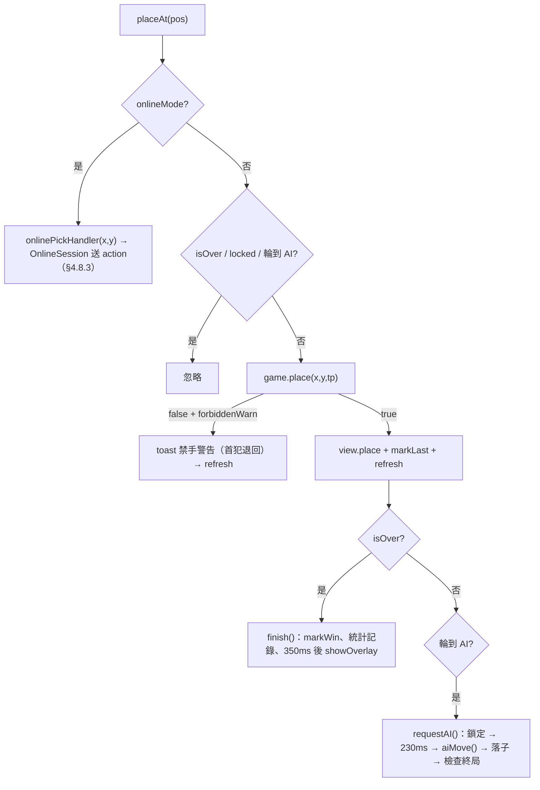

---

## 4.6 規則集選擇 UI 與暱稱驗證

### 4.6.1 規則集分段控制（`#screen-setup` 內）

| 項目 | 規格 | 來源 |
|---|---|---|
| DOM | `.seg.ruleset-seg`（role=group, aria-label=規則集）內三鈕：`data-ruleset="freestyle"` 自由／`"standard"` 標準／`"renju"` 連珠；`aria-pressed` 標示選中 | `index.html:257-261` |
| 說明文字 | `#ruleset-desc` 隨選擇切換（三段文案 `RULESET_DESC`） | `online/ui.js:51-55,341-348` |
| 預設值 | `selectedRuleset = "standard"`（標準） | `online/ui.js:56` |
| 互動 | 點擊即選（不需要「下一步」），同步 `aria-pressed` 與說明 | `online/ui.js:350-355` |
| 對局套用 | 建立房間時隨 `POST /api/rooms` 送 `ruleset`；對局全程依該規則集裁決（server 與 client 共用 `game.js`） | `online/ui.js:356-376`、`shared/protocol.js:60-63` |

三段文案（`online/ui.js:51-55`）：

- 自由：**自由五子棋：黑白對等無禁手，五連（含長連）即勝。**
- 標準：**標準無禁五子棋：黑白對等，剛好五連才算勝。**
- 連珠：**連珠（黑棋禁手）：黑棋受三三／四四／長連禁手限制，首犯退回、再犯判負。**

> 對照本地模式：難度與規則集綁定（簡單→自由、中等→標準、困難→連珠，`game.js:90-94`）；線上房間則由建立者明確選擇（`game.createGame({ruleset})`，`game.js:846`）。

### 4.6.2 暱稱輸入與驗證

| 項目 | 規格 | 來源 |
|---|---|---|
| 建立房間 | `#setup-name`：`maxlength=12`、`placeholder="玩家一"`、`autocomplete="nickname"`；空白時預設「玩家一」 | `index.html:265`、`online/ui.js:357` |
| 加入房間 | `#join-name`：`maxlength=12`、`placeholder="玩家二"`；空白時預設「觀眾」（觀戰）或「玩家二」 | `index.html:281`、`online/ui.js:389-392` |
| 持久化 | 暱稱存 `localStorage["gomoku:online:name"]`（`OnlineTokens.saveName`），兩個畫面載入時回填 | `online/tokens.js:28-35`、`online/ui.js:338,384` |
| 上限 | 顯示名稱上限 12 字（trim 後）＝`P.NAME_MAX`；client 以 maxlength 前擋，server 再窄化 | `shared/protocol.js:44-46` |
| 觀戰身分 | 第三人加入或 `?spectate=1`：標題「進入觀戰」、提示「以觀眾身分進場：可以在聊天室裡幫喊加油，但不能下棋。」；座位滿則提示「若座位已滿，將以觀眾身分進場（可聊天，不能下棋）。」 | `online/ui.js:378-387` |

---

## 4.7 線上大廳與戰情中心

### 4.7.1 大廳版面（`#screen-home`）

| 元件 | 規格 | 來源 |
|---|---|---|
| `#btn-back-home` | 「← 回主畫面」膠囊鈕（大廳左上） | `index.html:217`、`online/ui.js:1436-1441` |
| `.home-brand` | eyebrow「ONLINE BATTLE · 線上大廳」＋漸層標題＋說明 | `index.html:221-224`、`styles.css:375-393` |
| `#btn-online-create` | 主 CTA「⚔️ 建立房間對戰」（primary.big，暖色光暈） | `index.html:225`、`styles.css:396-403` |
| `#war-center` | 戰情中心（`hidden` 起始，`startLobby()` 顯示） | `index.html:228-244`、`online/ui.js:404-407` |
| `.online-footer` | Copyright + `#online-version` 版號 | `index.html:246-249` |

### 4.7.2 戰情中心（war-center）規格

| 元件 | 規格 | 來源 |
|---|---|---|
| 雷達脈動 | `.war-radar-pulse` 綠點，`radar-blink` 1.8s 無限動畫（opacity/scale/glow） | `index.html:229`、`styles.css:430-437` |
| WS badge `#ws-badge` | 「即時連線中」（`.on` 綠）／「重新連線中…」（`.off.disconnected` 紅）；WS 為唯一狀態來源 | `index.html:233`、`online/ui.js:437-441`、`styles.css:439-442` |
| 「只看交戰中」`#btn-war-live-only` | toggle（`aria-pressed`）；偏好存 `localStorage["warRoomLiveOnly"]`；切換用最後一份名單立即重渲染 | `index.html:234`、`online/ui.js:1477-1489`、`styles.css:446-455` |
| 統計三卡 `#war-games`／`#war-players`／`#war-spectators` | 進行戰局（非 finished 房數）／在線棋手（進行戰局 ×2）／即時觀戰（所有房 spectators 總和）；**統計含等待中房間，結束房不計** | `index.html:238-240`、`online/ui.js:536-556` |
| 房間列表 `#war-list` | grid 卡片（min 250px），最大高 480px 捲動 | `index.html:242`、`styles.css:460-462` |
| 空狀態 `#war-empty` | 「目前沒有進行中的對局 — 建立一場吧！」（整個列表空時）；「只看交戰中」下無交戰房時顯示列內空訊息 | `index.html:243`、`online/ui.js:558-566` |

**戰情卡片結構**（`warCard()`，`online/ui.js:573-668`）：

- 標題列：房號尾碼（`#XXXX`，最後 4 碼大寫，`roomIdTail()`）＋狀態標籤＋熱度標籤＋觀戰數標籤（`👁️ n`，>0 才顯示）。
- 狀態標籤（`warStatusTag()`，`online/ui.js:670-693`）：`waiting`「等待加入」（橘，呼吸點）、`playing`「交戰中」（紅，呼吸點 `radar-blink` 1.2s）、`finished`「🏁 已結束」（灰）。
- 熱度標籤（`warHeatTag()`，`online/ui.js:695-712`）：僅 `playing`；`turnNumber ≥ 40` →「⚔️ 激戰」；`turnNumber ≥ 20` 且黑白子差 ≤ 2 →「🔥 膠著」。
- 對戰列：黑方（左）— VS（漸層字＋「第 N 手」／等待房顯示「等待開局」）— 白方（右，反向排版）；無名顯示「（等待中）」/「等你來挑戰」。
- 均勢條：黑方子數佔比寬度的橫條＋文字（等待房顯示「靜候對手入座」）。
- 尾列：狀態文案（等待：已等待 N 秒 · 點擊直接加入／終局：終局 · 共 N 手／進行：已下 N 子 · 黑 x / 白 y）＋動作鈕（等待→「加入對戰」primary；進行→「進入觀戰」；終局→「觀看棋局」）。
- **變更閃爍**：與上一輪快照比對 `turnNumber`/黑白子數，有變化加 `.flash`（`warflash` 1.2s 金色漸層，`styles.css:470-471`）。
- 已結束房間整卡淡化 `.war-card-ended`（opacity 0.62）。

**公開曝光規則**（server 端裁決，前端只顯示；測試證據 `tests/lobby-rules.test.js:18-52`）：

| 房間狀態 | 曝光規則 |
|---|---|
| `playing` | 一律可列 |
| `waiting` | 建立滿 `LOBBY_WAIT_VISIBILITY_MS`（30 秒）後才公開曝光（防掃房） |
| `finished` | 終局起 `LOBBY_ENDED_RETENTION_MS`（5 分鐘）內保留在板上（供回看），屆滿下板 |

### 4.7.2 資料流：WS 推播為主、HTTP 輪詢兜底

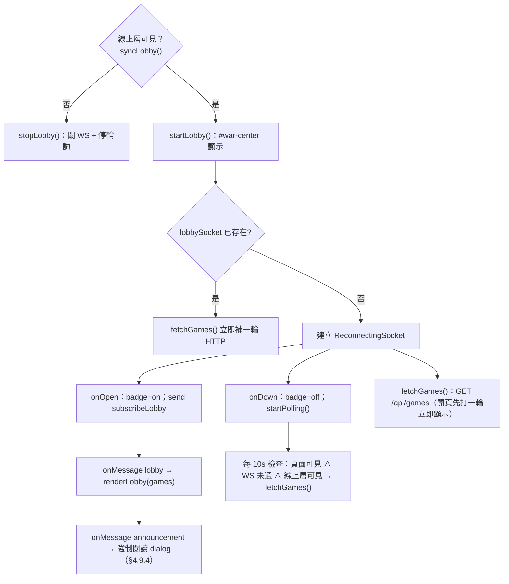

- 啟停條件（`syncLobby()`，`online/ui.js:398-402`）：`serverOk` 且 `#online-layer` 可見才啟動；進入對局（`showGameView()` → `stopLobby()`）或回入口首頁即停。
- 回到前景：`visibilitychange` → `syncLobby()` 立即補一輪（`online/ui.js:1524-1527`）。
- 輪詢實作：`startPolling()` 10 秒 interval，**頁面隱藏時暫停、WS 通時跳過、線上層不可見時不輪詢**（`online/ui.js:443-455`）。
- 資料源：`GET /api/games`（`fetchGames()`，`online/ui.js:457-463`）；WS 下行 `{t:"lobby", games:[...]}`（session 層亦路由 `onLobby`，`online/session.js:158`）。
- 渲染最佳化：`renderLobby()` 以 `JSON.stringify` 快照比對上一輪，決定卡片 `.flash`（`online/ui.js:540-553`）。

### 4.7.2.1 從戰情中心進入房間

- 「加入對戰」（等待房）：`goJoinRoom(roomId)` → `replaceState(null,"","/r/:roomId")` → 帶 token（若有）開 session（`online/ui.js:743-750`）。
- 「進入觀戰／觀看棋局」：`goSpectate(roomId)` → `replaceState(null,"","/r/:roomId?spectate=1")` → spectate session（`online/ui.js:735-741`）。

### 4.7.3 建立房間流程

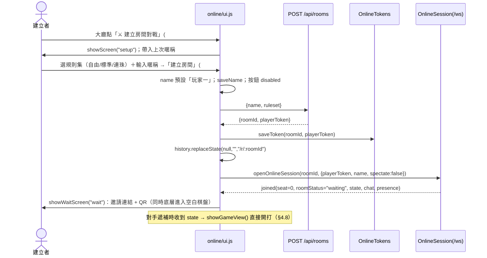

- 建立失敗：toast「建立房間失敗，請確認網路後再試」並還原按鈕（`online/ui.js:373-375`）。
- 等待畫面「取消並返回」：dispose session、**清除該房 token**、`leaveRoom()` 回大廳（`online/ui.js:1463-1468`）。

---

## 4.8 房間畫面規格（等待／加入／對局／終局）

### 4.8.1 加入與觀戰（`#screen-join`）

- 由 `/r/:roomId` 無 token 進入：標題「加入對戰」；`?spectate=1` 標題「進入觀戰」（§4.6.2）。
- 「加入」→ `joinRoom()`：暱稱預設後直接 `openOnlineSession`（不帶 token；server 依座位空位派 seat 或觀眾）。
- 「返回」→ `syncOnlineUrl()`＋`showScreen("home")`（`online/ui.js:1460-1462`）。

### 4.8.2 等待畫面（`#screen-wait`）

| 元件 | 規格 | 來源 |
|---|---|---|
| `#invite-url` | 唯讀輸入框：`location.origin + "/r/" + roomId` | `index.html:296`、`online/ui.js:906-908` |
| `#btn-copy-invite` | 複製連結：優先 `navigator.clipboard.writeText`，fallback `execCommand("copy")`；成功 toast「已複製！」，失敗「複製失敗，請長按連結」 | `online/ui.js:1360-1382` |
| `#invite-qr` | 168×168 canvas QR code；`QRCode.toCanvas(canvas, url, {width:168, margin:2, color:{dark:"#201709", light:"#efe6d8"}})`；**繪製失敗/程式庫未載入則隱藏**（對局不依賴 QR） | `index.html:299`、`online/ui.js:1338-1357` |
| `#btn-wait-cancel` | 取消並返回：dispose session、清 token、回大廳 | `online/ui.js:1463-1468` |
| 底層先行 | 等待同時 `GomokuOnline.enter()`（空白棋盤已就位），對手遞補的 state 到達即 `showGameView()` 開打 | `online/ui.js:910-912`、`online/ui.js:872-880` |

### 4.8.3 對局畫面（server-authoritative 鏡像渲染）

進入對局：`showGameView()`（收線上層、亮 HUD、標題還原、停戰情中心）→ `GomokuOnline.enter({mySeat, spectate, blackSeat, ruleset})`（清盤、`body.mode-online`）→ `applyState(state)` 全量重放。

- **本地鏡像**：`onlineApplyState()`（`app.js:1178-1205`）以 `G.createGame({vsAI:false, ruleset})` 重建並重放 moves；`winner/winLine` 從 DTO 還原（逾時/認輸/和棋等終局不反映在 moves）；`renderedMoves` 追蹤增量渲染；moves 變少（再來一局）→ 全量重建。
- **觀戰者與落子**：`onPick` handler（`online/ui.js:1529-1539`）——觀戰→toast「觀戰模式無法進行此操作」；已終局→「對局已結束」；非我回合→「還沒輪到你」；否則 `session.sendAction(x,y)`（seq 遞增）。**本地不裁決規則**，等 `actionApplied` 才渲染。

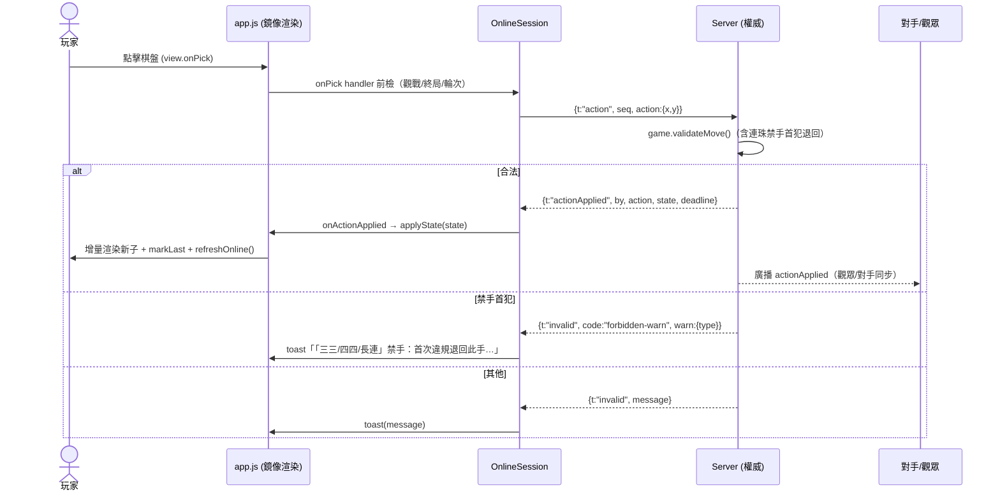

### 4.8.4 回合鐘與時鐘偏移校正（`#turn-timer`）

- Server 每次狀態變化附 `deadline {seat, at, pausedRemainingMs, graceAt, serverNow}`；session 收到即校正 **`clockOffset = serverNow - Date.now()`**，之後以 `Date.now() + offset` 計算剩餘（`online/session.js:170-196`）。
- 倒數顯示以 **250ms tick** 驅動（僅更新顯示，不做判決——判決由 server deadline 時間戳惰性裁定，Cloud Run CPU throttling 下計時器不可靠；AGENTS.md 架構鐵則）。
- 顯示規則（`renderTurnTimer()`，`online/ui.js:1233-1252`）：

| 情境 | 文案 | 樣式 |
|---|---|---|
| `graceRemainingMs`（輪到的人斷線） | 我方：「斷線寬限 m:ss」／對方：「對手重連中 m:ss」 | `.turn-timer.grace`（金） |
| `remainingMs`（正常回合） | 我方：「你的思考時間 m:ss」／對方：「對手思考時間 m:ss」 | 剩餘 <10s 加 `.urgent`（紅） |
| `pausedRemainingMs`（對手斷線、鐘暫停） | 「等待對手重連…」 | `.grace` |

- 回合鐘預設每手 60 秒、斷線寬限 90 秒（server `TURN_MS`/`GRACE_MS`，README）；逾期判負（reason `timeout`）。

### 4.8.5 輪到你提示與線上 HUD 文案（`refreshOnline()`，`app.js:1136-1161`）

- 回合膠囊：觀戰→「黑棋/白棋落子中（觀戰）」；輪到我→「輪到你落子」；否則「等待對手落子…」。
- 戰績面板：局數/勝率/連勝顯示「–」（CSS 於 `body.mode-online` 隱藏第 1/5/6 列），`#s-mode` 顯示「線上對戰（規則名）」或「線上觀戰（規則名）」。
- 線上模式隱藏本地控制：`body.mode-online` 時 CSS 隱藏 `#dock`、`#dock-open`、`#dock-close`、`#ov-new`、`#hint`（`styles.css:569-572`）。

### 4.8.6 聊天室與人員名單（`#chat-drawer`）

**抽屜**：fixed 右上（360×520 上限），**可按住標題列拖曳**（pointer events；第一次拖曳脫離 CSS 錨點改自由定位，視窗縮放時夾回可視範圍）（`online/ui.js:188-239`、`styles.css:546-560`）。手機版（≤760px）置底置中、高 70vh（`styles.css:641-643`）。

**聊天分頁（`#tab-chat` / `#pane-chat`）**：

- 訊息氣泡：自己靠右（`.mine`，藍底）、對手/觀眾靠左；快速訊息 `.canned` 金色；觀眾名稱標「（觀眾）」；自己的不顯示名稱列。
- **XSS 防護**：一律 `textContent`，絕不 `innerHTML`（`online/ui.js:1120` 註解）。
- 系統公告（`.chat-system`）：灰色置中，不進訊息歷史（協商公告、重連提示、終局訊息等，`systemNotice()`，`online/ui.js:1090-1097`）。
- 快速訊息 chips：`Protocol.CANNED_MESSAGES` 24 句（👋/🍀/⏰…），點擊 `session.sendCanned(id)`（`online/ui.js:1024-1036`、`shared/protocol.js:82-112`）。
- 輸入 `#chat-input` maxlength 120（`P.LIMITS.chatText`），送出 `session.sendChat(text.slice(0,120))` 後清空（`online/ui.js:1490-1498`）。
- 未讀徽章：抽屜未開或不在聊天分頁時，`unreadChat`/`unreadPeople` 累加（上限 99），同步 `#chat-badge`／`#tab-chat-badge`／`#tab-people-badge`（`updateBadges()`，`online/ui.js:1069-1083`）。
- 訊息修剪：列表 >200 則移除最舊（`trimChatList()`，`online/ui.js:1130-1134`）。
- Esc 關閉抽屜（modal 開著時讓給 modal）（`online/ui.js:1500-1507`）。

**人員分頁（`#pane-people`）**（`renderPeople()`，`online/ui.js:1140-1220`）：

- 對戰玩家：兩席（黑方排前），顯示座位標籤「黑/白」、名稱（未入座顯示「等待中」）、自己標「你」、狀態（`personStatus()`：等待加入 `wait`／連線中 `on` 綠／斷線重連中 `grace` 橘／離線 `off` 灰）。
- 觀戰人員：`spectatorList` 以 `Intl.Collator("zh-Hant-TW-u-co-stroke")` 筆畫排序（無 Intl 則不排序）；計數 `#people-spec-count`；自己（暱稱比對 `isSelfSpectator`）標「你」；空名單顯示「目前無觀戰人員」。

### 4.8.7 背景提醒（輪到你）

- 條件：輪到我 && `document.hidden` → `playBeep()`（WebAudio 880Hz sine，0.06 gain，220ms；AudioContext 相容 webkit 前綴）＋標題閃爍（每秒交替「🔔 輪到你了！」／原標題）；回到前景或輪次離開即停（`online/ui.js:1283-1331`）。
- 對手斷線膠囊：`#opponent-status`「對手已斷線」+ 系統公告「對手已斷線，等待重連…」；重連後系統公告「對手已重新連線」（`online/ui.js:1254-1281`）。

### 4.8.8 協商（和棋／提前結束／再來一局）與主選單（`#online-menu`）

```mermaid
sequenceDiagram
    participant A as 提議方
    participant SRV as Server
    participant B as 對方（坐席）
    participant SP as 觀眾

    A->>SRV: drawOffer / abortRequest / rematch（經確認 dialog）
    alt 對方坐席
        SRV->>B: drawOffered/abortOffered/rematchOffered(by)
        B->>B: openConfirm 對手提議對話框（同意/繼續下）
        B->>SRV: drawResponse/abortResponse/rematchResponse(accept)
        alt accept
            SRV-->>A,B,SP: 提議成立（和棋→gameOver reason="draw-agreed"；abort→"aborted"；rematch→rematchStart）
        else 拒絕
            SRV-->>A,B,SP: drawRejected 等 → 我方提出者收到系統公告「對方不同意…，繼續下！」
        end
    else 我方提出（廣播回來）
        SRV-->>A: offered(by===mySeat) → 系統公告「你提出了和棋，等待對方回應…」
    end
    Note over SP: 觀眾只看到系統公告（「對手提議和棋中…」）
```

- **主選單**（`#online-menu`，`online/ui.js:1333-1430`）：複製邀請連結（即時組 URL 再 copy）、提議和棋（確認後 `session.offerDraw()`）、結束對戰（對手離線→「直接結束不計勝負」文案，在線→「徵詢對方同意」）、認輸（確認後 `session.resign()`）、離開房間（提示「座位會保留，可用原邀請連結回來續戰」）。
- 可用性：`syncMenuAvailability()`——僅「有座位 ∧ 對局進行中」啟用和棋/結束/認輸，否則 disabled（`online/ui.js:1386-1391`）。
- **再來一局**：終局看板 `#ov-rematch`（僅坐席顯示）→ `session.offerRematch()`；對方接受 `rematchStart` → 關閉浮層/選單、系統公告「新的一局開始！」、`GomokuOnline.enter()` 重洗換先（`online/ui.js:1509-1513`、`online/ui.js:959-970`）。

### 4.8.9 終局看板（線上 `showResult`）

- 文案規則（`app.js:1246-1273`）：和局「和局 🤝」；坐席：「你獲勝了！🏆」／「你輸了這局 💪」；觀戰：「黑棋獲勝 ⚫／白棋獲勝 ⚪」；副標「`reasonText` · 共 N 手」（`P.reasonText` 八種終局文案，`shared/protocol.js:23-33`）。
- 終局原因文案：五連／禁手／滿盤和棋／同意和棋／走棋逾時／斷線逾時未回／認輸／提前結束（`shared/protocol.js:25-34`）。
- 坐席可見「再來一局」；觀眾不可（`showFinishedResult()`，`online/ui.js:851-870`）。
- 終局後系統公告：「🏁 對局結束：…」「歡迎留在聊天室繼續聊聊剛剛的戰局！」（`online/ui.js:972-981`）。

---

## 4.9 錯誤處理與重連 UX

### 4.9.1 ReconnectingSocket（`online/socket.js`）

| 參數/行為 | 值 | 來源 |
|---|---|---|
| WS URL | `wss://`（https 頁）/ `ws://` + `location.host + "/ws"` | `online/socket.js:9-12` |
| 退避 | 首次 1000ms，之後 `×1.7`，上限 10000ms（1s→1.7s→2.89s→…→10s） | `online/socket.js:15-18,68-80` |
| 重送 join | OnlineSession 每次 `onOpen` 重送 `join`（帶 token/name/spectate）→ 無縫復原 | `online/session.js:79-88` |
| 前景恢復 | `visibilitychange` 回到 visible 且 socket 已死 → 清退避、立即 `connect()` | `online/socket.js:82-94` |
| close() | 之後不再重連（`_closed`） | `online/socket.js:103-110` |
| malformed frame | JSON 解析失敗直接忽略 | `online/socket.js:48-52` |
| 測試證據 | 首次退避約 1s（900–1100ms） | `tests/online.test.js:186-208` |

### 4.9.2 對局中斷線 UX

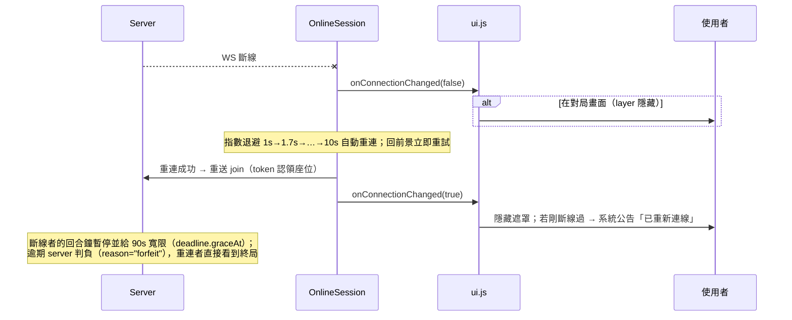

- 遮罩僅在**對局中**顯示（`inGameNow()` = `GomokuOnline.isActive()` 且線上層隱藏）（`online/ui.js:983-997`）。
- 對手斷線：`#opponent-status` 膠囊＋系統公告；回合鐘顯示寬限倒數（§4.8.4）。

### 4.9.3 伺服器錯誤碼分流（`online/session.js:160-172` → `online/ui.js`）

| 錯誤碼 | 前端反應 | 來源 |
|---|---|---|
| `room-not-found` | dispose session、清房間狀態、`GomokuOnline.leave()`、URL 同步 `/online`、回大廳、開確認框「找不到對局：房間可能已結束或連結有誤，請建立新的對戰邀請。」 | `online/ui.js:999-1008` |
| `rate-limited` | 系統公告「訊息太頻繁了，休息一下再聊」（聊天/訊息限速，不中斷對局） | `online/ui.js:1010-1012` |
| `connected-elsewhere` | dispose session（`socket.close()` 不再重連）、`leaveRoom()` 回大廳、確認框「已在中斷連線：你已在其他視窗加入此房間，此連線已中斷。」（單座位單連線政策） | `online/ui.js:1014-1021`、`online/session.js:167-169` |
| 其他 error | toast `msg.message`（預設「發生錯誤」） | `online/ui.js:794-796` |
| `invalid`（落子被拒） | `forbidden-warn` → 禁手 toast；其他 → toast message | `online/ui.js:918-931` |

### 4.9.3 Token 與重連回座

- 座位 token：`localStorage["gomoku:online:{roomId}"] = {token, savedAt}`；server 下發 `joined.playerToken` 時更新（`online/tokens.js:5-26`、`online/session.js:92-95`）。
- 同一邀請連結重新打開 → `openRoomUrl()` 帶 token 靜默重連（不經暱稱頁）；「取消並返回」與 `connected-elsewhere` 後清 token。
- private mode 寫入失敗即放棄（try/catch），功能不中斷（`online/tokens.js:9-11` 註解）。

### 4.9.4 全站公告（強制閱讀）

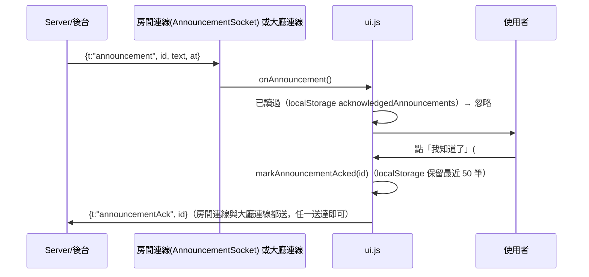

- 公告時間以 `zh-TW` 24 小時制顯示「發送於 …」（`online/ui.js:515-527`）。

---

## 4.10 設計系統

### 4.10.1 色彩變數（`styles.css:4-16`）

| 變數 | 值 | 用途 |
|---|---|---|
| `--bg-0` | `#0b1020` | 頁面底色（深藍夜） |
| `--bg-1` | `#141b31` | 漸層第二段 |
| `--panel` | `rgba(22,28,51,0.72)` | 面板底色（玻璃態） |
| `--panel-border` | `rgba(140,160,220,0.18)` | 面板邊框 |
| `--ink` | `#eaf0ff` | 主文字 |
| `--ink-dim` | `#9fb0d4` | 次要文字 |
| `--accent` | `#ff7a59` | 主強調（暖橘：CTA、最後一手、toast 邊框） |
| `--accent-2` | `#54d1ff` | 次強調（冰藍：連結、focus、選中態） |
| `--good` | `#5be0a1` | 成功／在線／雷達點 |
| `--shadow` | `0 18px 50px rgba(0,0,0,0.55)` | 通用陰影 |
| `--radius` | `16px` | 通用圓角 |

- 背景：三層 radial＋linear 漸層（`styles.css:21-31`）；3D 場景上另有 `#grade` multiply 漸層。
- 語意色（inline）：`.status-win` 綠（`--good`）、`.status-draw` 冰藍、`.war-tag-live` 紅系、`.war-tag-tight` 金（#ffd166）、`.war-tag-fierce` 紫（#c39bff）、`.ws-badge.off` 橘（#ffb072）、`.turn-timer.urgent` 紅（#ff8a75）。

### 4.10.2 字體與排版

- 字體棧：`"PingFang TC","Noto Sans TC","Microsoft JhengHei","Helvetica Neue",Helvetica,Arial,sans-serif`（系統字型，零字型下載）（`styles.css:18-20`）。
- 數字對齊：`font-variant-numeric: tabular-nums`（統計值、zoom 輸出、turn-timer、版本號）。
- 大標題漸層文字：`background-clip:text` 白→冰藍（品牌、大廳標題、entry-title 額外 drop-shadow）。
- 字級 clamp：entry 標題 `clamp(52px, 9vw, 108px)`；大廳標題 `clamp(26px, 4.6vw, 34px)`。

### 4.10.3 卡片與按鈕階層

| 元件 | 規格 | 來源 |
|---|---|---|
| 卡片 `.card` | 圓角 22px、漸層深底、`rise` 進場動畫、max-width min(90vw,440px) | `styles.css:210-216` |
| 線上卡片 `.online-card` | 寬 min(560px,94vw)、`--panel` 玻璃態；`.home-card` 加寬至 min(760px,96vw) | `styles.css:357-364` |
| 按鈕 `button.btn` | 圓角 12px、半透明白底、hover 上浮；`.primary` 暖橘漸層；`.big`／`.small` 尺寸；`.danger` 紅框（離開房間） | `styles.css:122-134,404-407` |
| 入口按鈕 `.entry-btn` | 大卡式按鈕（icon 52px + 雙行文案）、hover 上浮 + 邊框亮色（primary 冰藍 / online 暖橘） | `styles.css:668-694` |
| 分段控制 `.seg` | 深色圓角容器、選中 `[aria-pressed="true"]` 冰藍底＋inset 邊框；`.ruleset-seg` 為等寬三鈕變體 | `styles.css:135-146,411-418` |
| 禁用 | `opacity:.38; cursor:not-allowed`；`#seg-side.disabled` 整組降透明並擋事件 | `styles.css:131,162-165` |

### 4.10.4 動畫清單

| 名稱 | 用途 | 來源 |
|---|---|---|
| `fade` | 浮層/toast 淡入（0.35s / 0.25s） | `styles.css:278` |
| `rise` | 卡片上浮進場（0.5s cubic-bezier(.2,.8,.2,1)／線上 dialog 0.25s） | `styles.css:279` |
| `radar-blink` | 戰情中心雷達點＋交戰中/等待呼吸點（1.8s / 1.2s） | `styles.css:431-434` |
| `warflash` | 戰情卡片有新著手時金色閃爍 1.2s | `styles.css:470` |
| `pulse` | 重連遮罩文字呼吸 1.4s | `styles.css:520` |
| 落子動畫 | 3D 棋子 0.32s 落下＋勝局環脈動（JS 驅動，見 §4.5.3） | `app.js:329-341` |
| hint 淡出 | `#hint` opacity 過渡 0.5s（6.5s 後） | `styles.css:271`、`app.js:1050` |

### 4.10.5 RWD 斷點（單一斷點 760px）

`@media (max-width:760px)` 共三處：

1. **本地遊戲**（`styles.css:232-252`）：隱藏 `#stats`、`#hint`、品牌中文；HUD 上移；dock 改 94vw 換行排版（seg 佔整行、新局/撤銷對半、模式整行）；overlay 卡片改 flex 置中。
2. **線上層**（`styles.css:640-649`）：聊天抽屜改置底置中（94vw×70vh）；對手狀態膠囊上移；畫面 padding 縮小；war-list 高度改 46vh。
3. **入口首頁**（`styles.css:726-734`）：文字置中、footer 置中、背景改直向漸層強化可讀性。

### 4.10.6 無障礙盤點

| 機制 | 實例 | 來源 |
|---|---|---|
| `aria-label`（icon-only 按鈕） | `#dock-close`「收起控制面板」、`#dock-open`、`#btn-game-home`、`#ov-close`、`#ov-share`、`#ov-download`、`#btn-chat`、`#btn-online-menu`、`#btn-back-home`、`#drawer-close`、`#btn-announcement-ack` | `index.html` 各處（114,145,149,157,172,176,217,310,311,325,385） |
| `aria-pressed` | 難度/陣營 seg、規則集 seg、`#btn-war-live-only`（JS 同步 `true/false`） | `index.html:118-124,258-260`、`app.js:950-965`、`online/ui.js:341-355,1479-1488` |
| `role="group"` | 難度、執子陣營、規則集 seg | `index.html:117,122,257` |
| `role="dialog"` + `aria-modal` | `#overlay` 卡片（另 `aria-labelledby/describedby`）、`#online-dialog`、`#online-menu`、`#announcement-dialog` | `index.html:156,350,362,379` |
| `role="alert"` | `#reconnect-overlay` | `index.html:314` |
| `role="status"` + `aria-live="polite"` | `#toast`、`#chat-list`（新訊息朗讀） | `index.html:153,329` |
| `role="tablist"/"tab"/"tabpanel"` + `aria-selected` | 聊天抽屜雙分頁（JS 同步） | `index.html:321-323,328,336`、`online/ui.js:1050-1060` |
| `aria-valuetext` | 縮放滑桿同步「NN%」（3D 滾輪也會更新） | `app.js:976`、測試 `tests/app3d.test.js:171-185` |
| `focus-visible` | 滑桿與 overlay 關閉鈕有可見 focus 外框 | `styles.css:168,206` |
| `aria-hidden` | 裝飾性呼吸點/emoji icon | `online/ui.js:677-681`、`index.html:194` |

---

## 4.11 資源載入與快取

### 4.11.1 版本化快取（`?v=__ASSET_VER__`）

- 伺服器於**請求時**把 `?v=__ASSET_VER__` 替換為檔案內容雜湊（sha1 前 8 碼）；JS/CSS 更新後 URL 自動改變，瀏覽器不吃舊快取；**純靜態託管時佔位符只是普通查詢字串，不影響載入**（`index.html:71-73` 註解、AGENTS.md 架構鐵則）。
- **新檔案也要掛上 `?v=__ASSET_VER__`**（AGENTS.md）。

### 4.11.2 資源清單

| 資源 | 來源 | 備註 |
|---|---|---|
| three.js 0.160.0 | CDN `https://unpkg.com/three@0.160.0/build/three.min.js`（`index.html:78`） | 唯一外部 JS；載入失敗 → 2D 備援 |
| qrcode.min.js | 本機 `assets/vendor/`（`index.html:391`） | 從 CDN 改本機打包，QR 不依賴網路 |
| Chart.js | `assets/vendor/chart.umd.min.js`（僅 admin.html 使用） | 前台不用 |
| styles.css | `?v=__ASSET_VER__`（`index.html:74`） | 單一樣式檔 660 行 |
| 字型 | 系統字型棧（PingFang TC 等），**不下載任何 webfont** | `styles.css:18-20` |
| 圖示 | 內嵌 SVG（stroke currentColor），**無圖示庫** | `index.html` dock/overlay 按鈕 |
| favicon 組 | `/favicon.ico` + PNG 16/32/48/192/512 + apple-touch-icon 180 | `index.html:72-77` |
| OG / Twitter / JSON-LD | og-image.png 1200×630、WebApplication schema | `index.html:24-68` |
| 入口背景 | `assets/home-bg.webp`（AI 生成，cover） | `styles.css:631-635,731-733` |
| SEO | canonical 指向 `five-chess-game.gh.miniasp.com`、`theme-color #0b1020`、viewport `user-scalable=no` | `index.html:5-22` |

### 4.11.3 載入時序

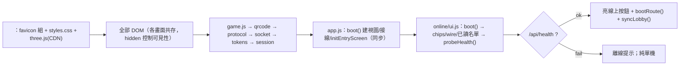

---

## 4.12 前端狀態管理與事件綁定清單

### 4.12.1 全域 DOM 快取（`els` 物件）

- `app.js:74-87`：單機層元素（gl/fallback/turn/stats/hint/toast/overlay/zoom/dock…）。
- `online/ui.js:12-49`：線上層全部元素（約 60 個 id，一次 `$()` 收集；`#online-layer` 不存在即整支停用——純靜態部署安全）。

### 4.12.2 畫面切換函式

| 函式 | 行為 | 來源 |
|---|---|---|
| `showScreen(name)` | 收入口 → 顯示 `#online-layer` → 唯一亮出 `screen-{name}`（home/setup/join/wait）→ 標題=大廳 → `syncLobby()` | `online/ui.js:112-124` |
| `showGameView()` | 收入口與線上層、亮 `#online-hud`、標題還原、`stopLobby()` | `online/ui.js:136-143` |
| `hideOnlineLayer()` | 僅收線上層＋停戰情中心 | `online/ui.js:146-149` |
| `goEntryHome()` | teardown 房間、收線上層、標題還原、`GomokuEntry.show()` | `online/ui.js:151-157` |
| `teardownRoom()` | dispose session、清房間狀態與未讀、收 HUD/遮罩/抽屜/dialog/選單、隱藏再來一局、`GomokuOnline.leave()`（還原本地遊戲） | `online/ui.js:159-177` |
| `hideEntry/showEntry` | `#screen-entry` + `body.entry-open` 切換 | `app.js:1063-1074` |

### 4.12.3 線上層狀態變數（`online/ui.js:56-107`）

`selectedRuleset`、`session`（房間 OnlineSession）、`lobbySocket`（戰情中心 WS）、`currentRoomId`、`mySeat`（0/1/null=觀眾）、`spectate`、`presence`、`lastStateDTO`、`lastResultShown`、`drawerOpen/drawerTab`、`unreadChat/unreadPeople`、`lastLobbySnapshot`、`lastLiveGames`、`warLiveOnly`、`pollTimer`、`wsDown`、`serverOk`、`notifyTimer`、`pushedOnline`、`confirmHandler/confirmCancelHandler`、`lastDeadlineInfo`、`yourTurnAlarm`、`ackedAnnouncements`、`LOBBY_TITLE`。

本地層（`app.js:30-63`）：`difficulty`、`currentZoom`、`playerSide`、`vsAI`、`locked`、`undoUsed`、`view`（3D/2D view 物件）、`stats/statsSnapshot`；線上鏡像（`app.js:1124-1134`）：`onlineMode`、`onlinePickHandler`、`onlineCtx`、`renderedMoves`。

### 4.12.4 事件綁定清單（主要按鈕 → handler）

**單機（`wireUI()`，`app.js:984-1043`；入口 `initEntryScreen()`，`app.js:1091-1130`）**

| 觸發源 | Handler |
|---|---|
| `.seg [data-diff]` click | 改難度（連動規則集）＋同步 aria-pressed＋保存 |
| `.seg [data-side]`（`#seg-side`） | 切執子（開新局）＋同步 |
| `#btn-new`／`#ov-new` | `newGame()`（關面板與浮層） |
| `#btn-undo` | 撤銷（undoLimit 檢查；已終局→`revertResult()` 統計還原；AI 局撤兩手） |
| `#btn-mode` | 對戰 AI ↔ 雙人類 |
| `#zoom-range` input | `setZoom()`（同步 output/aria-valuetext/view/storage） |
| `#ov-close` | `closeOverlay()`（顯示落子編號） |
| `#turn`（回合膠囊） | `reopenOverlay()`（進行中顯示現況，結束顯示結果） |
| `#ov-share`／`#ov-download` | `shareResult()`／`downloadResult()`（Web Share API → 下載 fallback） |
| `#dock-close`／`#dock-open` | 控制列收合/重開 |
| `#btn-game-home` | 未落子直接回；已落子經 `GomokuConfirm`（進度保留） |
| `#btn-entry-local` | push `/game` → hideEntry |
| `window resize` | view.resize + syncDock |

**線上（`wire()`，`online/ui.js:1433-1529`）**

| 觸發源 | Handler |
|---|---|
| `#btn-entry-online` | serverOk 檢查 → push `/online` → `showScreen("home")` |
| `#btn-online-create` | `openSetupScreen()` |
| `#btn-back-home` | back 或 replace `/` → `goEntryHome()` |
| `.ruleset-seg [data-ruleset]` | 選規則集（載入時即綁定） |
| `#btn-create-room` | `createRoom()`（POST /api/rooms → token → `/r/:id` → session） |
| `#btn-setup-back`／`#btn-join-back` | 回大廳 |
| `#btn-join-room` | `joinRoom()` |
| `#btn-copy-invite`／`#menu-copy` | `copyInvite()` |
| `#btn-wait-cancel` | dispose＋清 token＋`leaveRoom()` |
| `#od-ok`／`#od-cancel` | 執行確認/取消 handler（取消也回呼——協商婉拒需回應對方） |
| `#btn-announcement-ack` | 已讀回條 |
| `#btn-war-live-only` | 只看交戰中 toggle（localStorage + 立即重渲染） |
| `#btn-chat`／`#drawer-close` | 抽屜開合 |
| `#tab-chat`／`#tab-people` | 分頁切換（清未讀） |
| `#chat-form` submit | `sendChat`（trim、截 120） |
| Esc（document） | 關抽屜（modal 優先） |
| `#btn-online-menu`／`#menu-close` | 選單開合（開啟時先 sync 可用性） |
| `#menu-draw`／`#menu-abort`／`#menu-resign`／`#menu-leave` | 對應協商/離開（皆經確認框） |
| `#ov-rematch` | `offerRematch()` |
| `GomokuOnline.onPick` | 落子意圖前檢 → `session.sendAction(x,y)` |
| `visibilitychange` | 回前景 `syncLobby()` |
| `popstate` | `onPopState()` 畫面對齊 |
| `#drawer-head` pointer | 抽屜拖曳 |

### 4.12.5 Session 回呼註冊（`openOnlineSession()`，`online/ui.js:754-795`）

`onJoined`（入座/等待/終局分派）、`onState`（含對手遞補自動開打）、`onActionApplied`、`onInvalid`、`onChat`/`onChatHistory`、`onPresence`、`onCountdown`、`onDrawOffered/Rejected`、`onAbortOffered/Rejected`、`onRematchOffered/Rejected/Start`、`onGameOver`、`onConnectionChanged`、`onRoomNotFound`、`onRateLimited`、`onConnectedElsewhere`、`onError`；socket 以 `AnnouncementSocket` 包裝（房間連線也攔公告）。

---

## 4.13 瀏覽器相容與效能考量

### 4.13.1 相容性策略

| 領域 | 策略 | 來源 |
|---|---|---|
| 3D 支援 | `window.THREE` 不存在即 2D Canvas（涵蓋 CDN 被擋/離線/極舊瀏覽器） | `app.js:531-543` |
| Pointer Events | 3D/2D 皆用 Pointer Events（含 `setPointerCapture` try/catch） | `app.js:306,221` |
| 剪貼簿 | `navigator.clipboard` → `execCommand("copy")` textarea fallback | `online/ui.js:1360-1382` |
| Web Share | `nav.share` + `nav.canShare({files})` 探測 → 下載 fallback | `app.js:846-869` |
| Web Audio | `window.AudioContext || webkitAudioContext`，失敗靜默 | `online/ui.js:1313-1331` |
| Intl 排序 | `Intl.Collator` 不存在時不做筆畫排序 | `online/ui.js:1139` |
| Blob | `canvas.toDataURL` 手工轉 Blob → `canvas.toBlob` fallback | `app.js:750-771` |
| History API | 所有 pushState/replaceState 包 try/catch（靜態託管 file:// 不炸） | `app.js:1082-1086`、`online/ui.js:1229` |
| CSS | `backdrop-filter` 同時寫 `-webkit-` 前綴；`clamp()`/`min()` 現代語法 | `styles.css` 通篇 |
| 視口 | `maximum-scale=1.0, user-scalable=no`（遊戲手勢優先） | `index.html:5` |

### 4.13.2 效能與低階裝置

| 主题 | 做法 | 來源 |
|---|---|---|
| GPU/電力 | `devicePixelRatio` 上限 2；2D 模式無 rAF 迴圈（事件驅動重繪） | `app.js:132,418-424` |
| 陰影 | shadow map 2048²、`bias -0.0004`（單一主光） | `app.js:145-151` |
| AI 運算 | 候選格 radius=2、minimax 節點預算 0x100000、取分前 10 候選、alpha-beta 剪枝；VCF 深度 10／預算 12000；預算用盡退回貪婪保證合法落點 | `game.js:787-808,836-846,918-948` |
| AI 乘法延遲 | 230ms 人為延遲：讓 AI「思考中」可感知且避免同幀阻塞 | `app.js:574-585` |
| 聊天記憶體 | 列表上限 200 則修剪；未讀徽章上限 99 | `online/ui.js:1130-1134,1069-1083` |
| 戰情中心 | WS 推播為主；HTTP 輪詢僅 10s、且要求（可見 ∧ WS 斷 ∧ 大廳可見）；JSON 快照比對避免整表重繪閃爍 | `online/ui.js:443-465,536-556` |
| 頁面隱藏 | 輪詢暫停；visibilitychange 回前景立即補一輪＋WS 立即重試；標題閃爍自動停 | `online/ui.js:449,1524-1527`、`online/socket.js:82-94`、`online/ui.js:1307-1310` |
| CPU throttling（Cloud Run/瀏覽器節流） | 計時真相在 server deadline 時間戳（惰性判定），client tick 只更新倒數顯示；重連後重送 join 即復原 | AGENTS.md 架構鐵則、`online/session.js:1-5,79-88` |
| WS 指數退避 | 1s→×1.7→10s 封頂；close() 後停；前景恢復立即重試 | `online/socket.js:15-18,68-94` |

### 4.13.3 已知取捨

- 棋盤互動以 Pointer Events 為基礎，未提供鍵盤落子（無障礙面以 aria 標示與鍵盤可達的按鈕操作為主）。
- three.js 版本鎖定 0.160.0 且走 unpkg CDN；無 SRI/本地備援——但 2D 備援保證可玩性。
- `user-scalable=no` 犧牲縮放無障礙以換取棋盤手勢體驗。

---

## 4.14 行為規格測試對照表

| 規格條目 | 測試證據 |
|---|---|
| 2D 備援路徑啟動、預設難度/縮放、HUD 初始值 | `tests/app.smoke.test.js:96-104` |
| 落子→AI 回應節奏（230ms）、子數同步 | `tests/app.smoke.test.js:106-121` |
| 撤銷限制（困難禁用／中等 1 次／簡單無限） | `tests/app.smoke.test.js:129-166` |
| 難度/縮放/執子設定持久化（`gomoku-settings-v1`） | `tests/app.smoke.test.js:237-255` |
| 執白時 AI 先手、HUD「輪到白棋（你）」 | `tests/app.smoke.test.js:257-275` |
| 控制列收合/重開（桌面與行動） | `tests/app.smoke.test.js:284-313` |
| 結果看板：延遲顯示、X 關閉、點膠囊重開、新局 | `tests/app.smoke.test.js:316-356` |
| 分享圖片 1200×1450、檔名格式、署名、按鈕綁定 | `tests/app.smoke.test.js:358-396` |
| 統計（勝率/連勝）與悔棋還原 | `tests/app.smoke.test.js:432-450` |
| 3D 路徑：gl/fallback 切換、拾取落子、落子動畫 | `tests/app3d.test.js:140-160` |
| 3D 勝局高亮脈動 | `tests/app3d.test.js:162-170` |
| 滾輪縮放同步 output／滑桿／aria-valuetext | `tests/app3d.test.js:171-185` |
| 3D 拖曳 orbit／hover／難度切換／和棋狀態 | `tests/app3d.test.js:190-219` |
| session 每次 onOpen 重送 join（帶 token/name/spectate） | `tests/online.test.js:44-55` |
| joined 訊息路由（seat/blackSeat/chatHistory/presence） | `tests/online.test.js:57-81` |
| actionApplied/invalid/chat/gameOver 路由 | `tests/online.test.js:83-105` |
| deadline 倒數含時鐘偏移校正（250ms tick，慢 5s 校正後約 30s） | `tests/online.test.js:107-123` |
| seq 遞增、sendAction payload | `tests/online.test.js:125-136` |
| 錯誤碼分流（room-not-found／rate-limited／connected-elsewhere 後不再重連） | `tests/online.test.js:138-158` |
| WS 指數退避首次約 1s | `tests/online.test.js:186-208` |
| 戰情中心曝光規則（waiting 30s 曝光／finished 5 分鐘保留／playing 恆列） | `tests/lobby-rules.test.js:18-52`（server 端 `server/rooms.js isLobbyListable`） |
| 整合（真實 HTTP+WS：建立房間、坐席、動作、聊天、協商、終局） | `tests/integration.test.js`（另見 05-backend 章） |

---

> 維護備註：行號對應 v0.3.2。新增前台功能時請（1）維持零 build 與 `?v=__ASSET_VER__` 慣例、（2）沿用既有全域 API 黏合（勿新增 bundler 或框架）、（3）同步更新本規格與 `tests/` 行為證據。